<div align="center">
  

  <h1>NexCon</h1>

  <p>
    Nền tảng giao tiếp realtime đa nền tảng: kết nối bạn bè, chat cá nhân và nhóm,
    gọi audio/video, phòng họp, nhắc hẹn, thông báo, kiểm duyệt nội dung và quản trị hệ thống.
  </p>

  <p>
    <a href="https://github.com/ToiLaBao2004/NexCon/actions/workflows/ci.yml">
      
    </a>
    
    
    
    
  </p>
</div>

---

## Mục lục

- [Tổng quan](#tổng-quan)
- [Tính năng hệ thống](#tính-năng-hệ-thống)
- [Kiến trúc](#kiến-trúc)
- [Workflow theo tính năng](#workflow-theo-tính-năng)
- [API, realtime và worker](#api-realtime-và-worker)
- [Công nghệ](#công-nghệ)
- [Cấu trúc thư mục](#cấu-trúc-thư-mục)
- [Cài đặt và chạy local](#cài-đặt-và-chạy-local)
- [Kiểm thử và CI/CD](#kiểm-thử-và-cicd)
- [Deploy](#deploy)
- [Bảo mật và vận hành](#bảo-mật-và-vận-hành)

## Tổng quan

**NexCon** là ứng dụng giao tiếp full-stack hướng production, phục vụ cả web và Android.
Hệ thống kết hợp REST API, Socket.IO, MongoDB, Redis, BullMQ, LiveKit, Cloudinary,
Web Push và Firebase Cloud Messaging để xử lý trải nghiệm realtime và các tác vụ nền.

Các nhóm người dùng:

| Vai trò | Khả năng chính |
| --- | --- |
| Khách | Đăng ký, đăng nhập, xác minh OTP, đặt lại mật khẩu, Google OAuth, gửi kháng cáo khi tài khoản bị khóa |
| Người dùng | Kết bạn, chat, gọi, họp, tạo reminder, nhận thông báo, quản lý hồ sơ và phiên đăng nhập |
| Quản trị viên | Xem dashboard, observability, audit log, báo cáo, AI review, vi phạm, khóa/mở khóa tài khoản và xử lý kháng cáo |

Các màn hình frontend chính:

| Route | Chức năng |
| --- | --- |
| `/signin`, `/signup`, `/otp`, `/otp-resetpass`, `/reset-password` | Xác thực tài khoản |
| `/chat` | Chat cá nhân, nhóm, tìm kiếm, media, call và disappearing messages |
| `/people` | Bạn bè, lời mời, gợi ý, danh sách chặn |
| `/meet` | Tạo hoặc tham gia phòng họp bằng mã phòng |
| `/reminder`, `/reminders` | Quản lý reminder cá nhân và reminder chung |
| `/notification` | Danh sách thông báo trong ứng dụng |
| `/reports/my` | Lịch sử báo cáo của người dùng |
| `/moderation` | Trạng thái vi phạm và hạn chế tài khoản |
| `/settings/sessions` | Quản lý các phiên đăng nhập |
| `/admin/*` | Dashboard quản trị, giám sát, báo cáo và kháng cáo |

## Tính năng hệ thống

### Xác thực và bảo mật tài khoản

- Đăng ký, đăng nhập, đăng xuất một phiên hoặc toàn bộ phiên.
- Access token JWT và refresh token theo session.
- Google OAuth cho web và Google Sign-In cho mobile.
- OTP qua email cho đăng ký và đặt lại mật khẩu.
- Quản lý danh sách thiết bị/phiên đăng nhập và thu hồi từng phiên.
- Rate limit riêng cho signup, signin, OTP và API chung.
- Tự ngắt Socket.IO khi session bị thu hồi hoặc tài khoản bị khóa.

### Hồ sơ, quyền riêng tư và trạng thái

- Cập nhật tên hiển thị, avatar, bio, số điện thoại và phạm vi hiển thị hồ sơ.
- Gắn bài hát vào hồ sơ qua Spotify search.
- Trạng thái realtime: online, away, busy, do not disturb, invisible và last seen.
- Chế độ trạng thái tự động hoặc thủ công.
- Chỉ công bố presence phù hợp với quan hệ và quyền xem hồ sơ.

### Kết nối bạn bè

- Tìm người dùng, gửi, hủy, chấp nhận, từ chối và gửi lại lời mời kết bạn.
- Gợi ý bạn bè.
- Đặt biệt danh cho bạn bè.
- Hủy kết bạn, chặn và bỏ chặn người dùng.
- Đồng bộ thay đổi qua Socket.IO.

### Chat realtime

- Hội thoại 1-1 và nhóm.
- Tin nhắn text, image, audio/voice, file, link, sticker và system message.
- Reply, emoji reaction, recall, pin/unpin và forward nhiều hội thoại.
- Mention người dùng, mention inbox và số lượng mention chưa đọc.
- Typing indicator, unread count, mark as seen, mark as unread và delivery acknowledgement.
- Pin hội thoại, mute riêng tin nhắn hoặc cuộc gọi theo thời lượng.
- Media sidebar cho ảnh, file và link; media Cloudinary được cấp signed URL.
- Tìm kiếm trong hội thoại theo từ khóa, người gửi và khoảng ngày.
- Global search người dùng, hội thoại và tin nhắn; hỗ trợ progressive response bằng NDJSON stream.
- Nội dung text và chỉ mục tìm kiếm được mã hóa ở tầng ứng dụng bằng AES-256-GCM.

> Mã hóa nội dung hiện tại là mã hóa ở tầng lưu trữ của backend, không phải end-to-end encryption.

### Disappearing messages

- Bật/tắt chế độ tin nhắn tự xóa trong hội thoại trực tiếp hoặc nhóm.
- Thành viên trong direct chat và admin nhóm có quyền thay đổi cấu hình.
- Chế độ tự tắt sau thời lượng được chọn; mỗi tin nhắn mới trong chế độ này hết hạn sau **24 giờ cố định**.
- Tin nhắn forward từ nguồn disappearing vẫn là disappearing và nhận TTL 24 giờ mới tại đích.
- Tin hết hạn được soft-delete: ẩn nội dung, bỏ reaction, bỏ pin, xóa `searchContent` và phát event cập nhật UI.
- Media Cloudinary chỉ bị xóa khi không còn tin nhắn active khác cùng tham chiếu asset.
- Android 14+ phát hiện screenshot trong hội thoại disappearing và thông báo cho các thành viên còn lại.

Tài liệu chi tiết: [docs/dm-disappearing-messages.md](./docs/dm-disappearing-messages.md).

### Quản lý nhóm

- Tạo nhóm, đổi tên, đổi avatar, thêm và xóa thành viên.
- Chuyển quyền admin, rời nhóm và giải tán nhóm.
- Tùy chọn yêu cầu admin duyệt thành viên mới.
- Tùy chọn cho phép thành viên đổi avatar nhóm và tạo reminder chung.
- Khi nhóm bị giải tán, dữ liệu được giữ trong thời gian retention rồi BullMQ worker xóa message, reminder và media.

### Gọi audio/video và phòng họp

- Direct call audio/video giữa hai người dùng.
- Group call audio/video trong hội thoại nhóm.
- Call state lưu Redis để nhiều backend replica cùng xử lý nhất quán.
- Ring timeout, từ chối, hủy, kết thúc, disconnect recovery và system message lịch sử call.
- Push call đến Android khi ứng dụng ở background, có màn hình incoming call và action trả lời/từ chối.
- Phòng họp LiveKit bằng mã dạng `abc-defg-hjk`.
- Tạo phòng ngay hoặc lên lịch; host có thể bật waiting room và duyệt người tham gia.
- Waiting room tự timeout sau 5 phút nếu host chưa xử lý.

### Reminder và lịch họp

- Reminder cá nhân hoặc reminder chung trong hội thoại.
- Tạo reminder thủ công, từ một tin nhắn hoặc khi lên lịch họp.
- Lặp lại theo ngày, tuần hoặc tháng.
- Snooze 5, 10, 30 hoặc 60 phút; dismiss và xóa theo phạm vi.
- Thành viên có thể tham gia hoặc rời reminder chung.
- BullMQ phát reminder qua socket, in-app notification, push notification và email nếu được cấu hình.
- Server reload các reminder đang chờ vào queue sau khi khởi động lại.

### Thông báo đa kênh

- Thông báo trong ứng dụng và đồng bộ realtime.
- Web Push qua VAPID và service worker.
- Firebase Cloud Messaging cho Android.
- Local notification Android khi nhận tin nhắn lúc app đang chạy.
- Push cho message, mention, reminder, lời mời bạn bè, trạng thái moderation và incoming call.
- Mark as read, mark all as read, mark as unread và xóa notification.

### Moderation và quản trị

- Moderation khi gửi text, link, image và transcript của voice message.
- Kiểm tra local signal kết hợp Google Gemini; AssemblyAI dùng để transcribe audio.
- Báo cáo tin nhắn hoặc người dùng với snapshot bằng chứng.
- Admin review thủ công hoặc chạy AI review theo batch cho báo cáo tin nhắn.
- Ghi nhận lịch sử vi phạm, decay điểm vi phạm theo thời gian và tự khóa tài khoản khi vượt ngưỡng.
- Người dùng xem trạng thái moderation và gửi kháng cáo từ màn hình đăng nhập khi bị khóa.
- Admin dashboard: thống kê user, report, appeal; khóa/mở khóa user; xem group, message, resolved report và audit log của user.
- Admin observability: request count, error rate, latency, egress, message count, user mới, report, active user và runtime CPU/memory.

### Web và Android

- Web app responsive bằng React.
- Android app dùng Capacitor.
- Native Google Sign-In, FCM, local notification, full-screen incoming call và screenshot bridge trên Android.
- Repository hiện chưa có target iOS.

## Kiến trúc

### Sơ đồ tổng thể

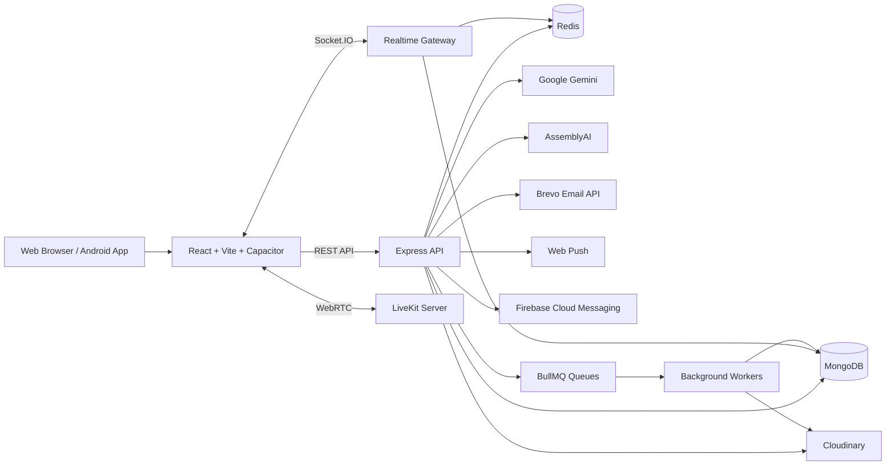

### Frontend

Frontend nằm trong `frontend/`:

- React 19, TypeScript, Vite 7 và Tailwind CSS.
- Zustand quản lý auth, chat, friend, socket, notification, reminder, call, group call, meeting, theme và media cache.
- Axios gọi REST API; Socket.IO Client nhận cập nhật realtime.
- LiveKit Client xử lý audio/video.
- Capacitor bridge cung cấp Android runtime, FCM, Google Sign-In, local notification và native screenshot event.

### Backend

Backend nằm trong `backend/`:

- Express 5 cung cấp REST API.
- Mongoose thao tác MongoDB.
- Socket.IO xử lý presence, chat event và signaling call.
- Redis đảm nhiệm presence, call state, Socket.IO adapter, moderation violation counter và BullMQ.
- Worker xử lý reminder, realtime timeout, disappearing expiry và cleanup dữ liệu.
- Cloudinary lưu media authenticated; backend sinh signed URL khi client cần đọc.

### Multi-replica Socket.IO

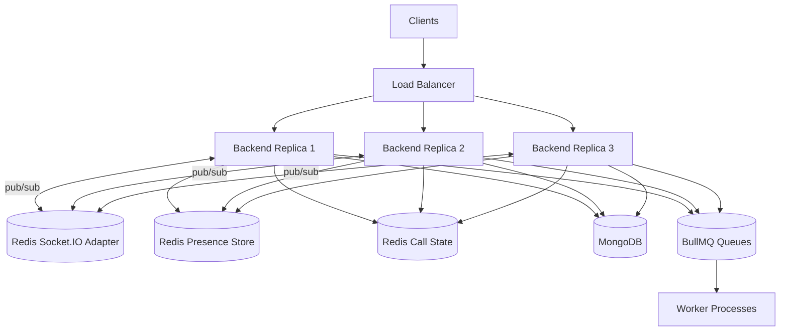

Mỗi socket sau khi xác thực sẽ join:

- `user:<userId>` để đồng bộ mọi thiết bị của một người dùng.
- `session:<sessionId>` để thu hồi đúng session.
- `<conversationId>` để nhận event của hội thoại.

Redis Adapter phát broadcast giữa các replica. Redis presence store và call state giúp dữ liệu realtime
không phụ thuộc vào memory local của một process.

### Queue và tác vụ nền

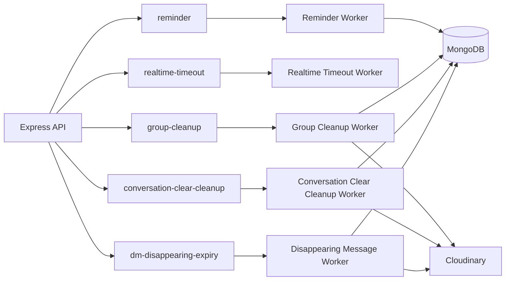

## Workflow theo tính năng

### 1. Đăng ký và đăng nhập

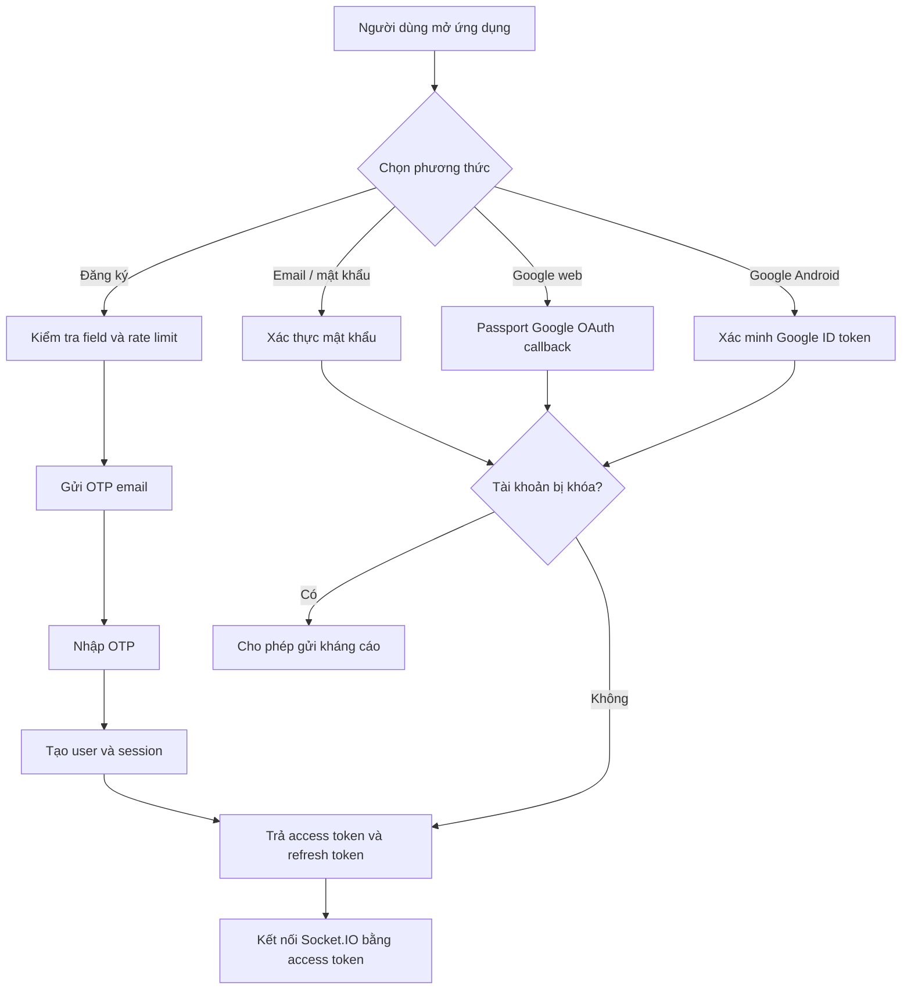

### 2. Gửi và nhận tin nhắn realtime

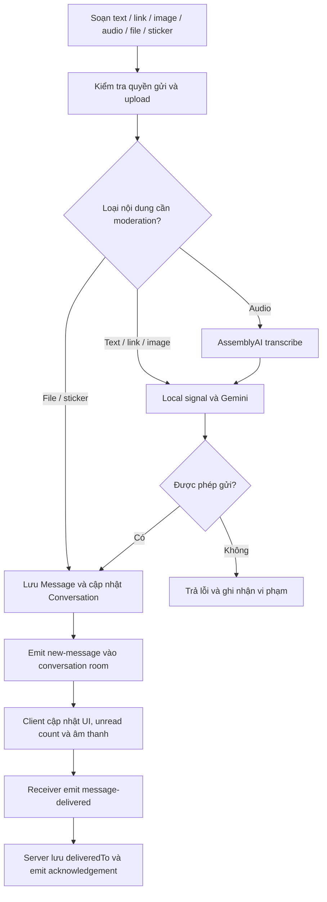

### 3. Global search

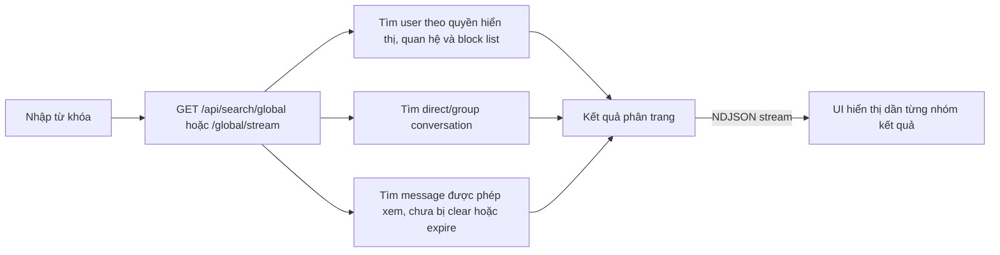

### 4. Disappearing messages

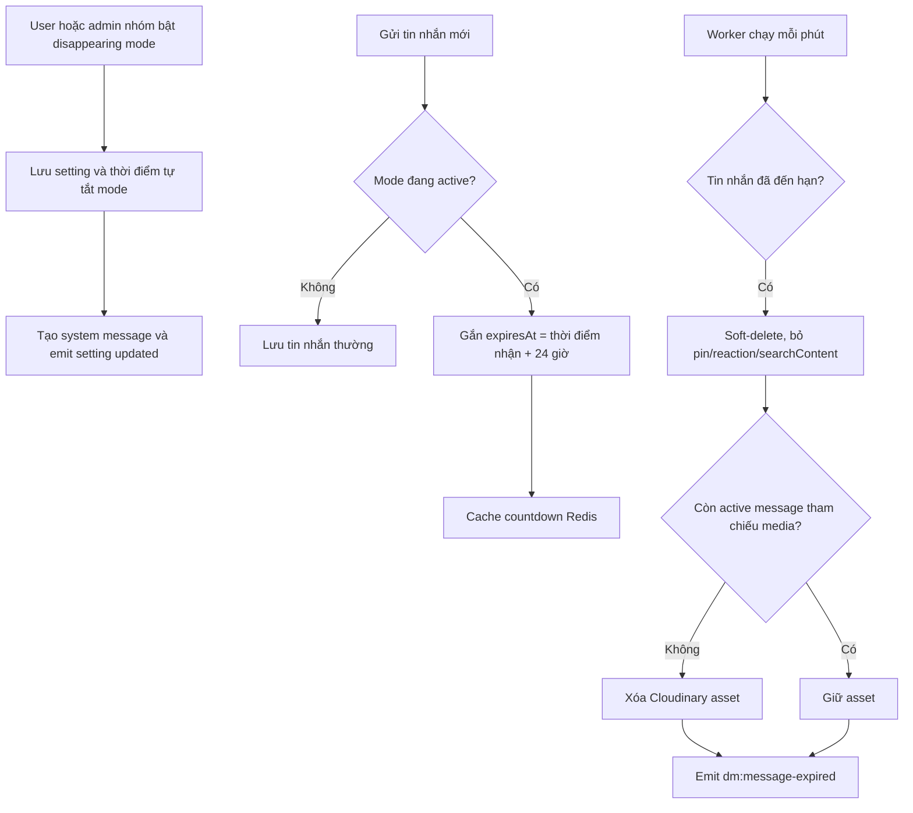

Screenshot Android:

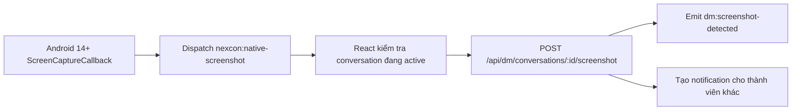

### 5. Quản lý nhóm

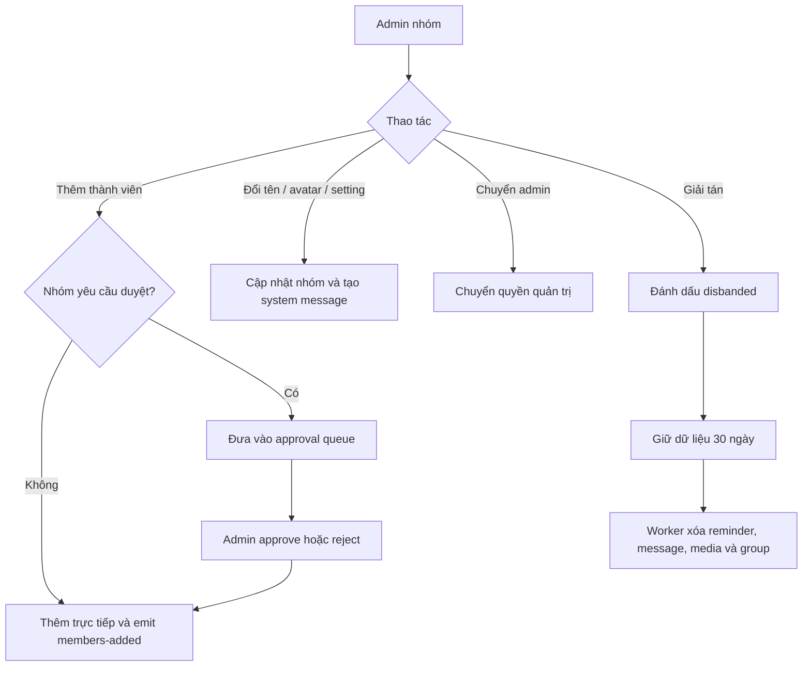

### 6. Direct call, group call và meeting

Direct call:

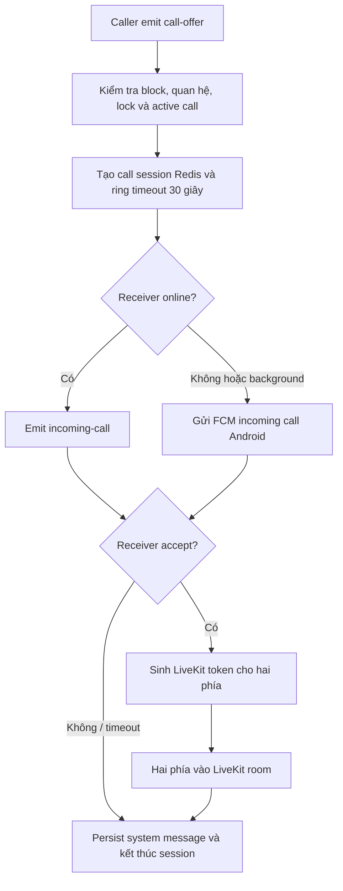

Group call và meeting:

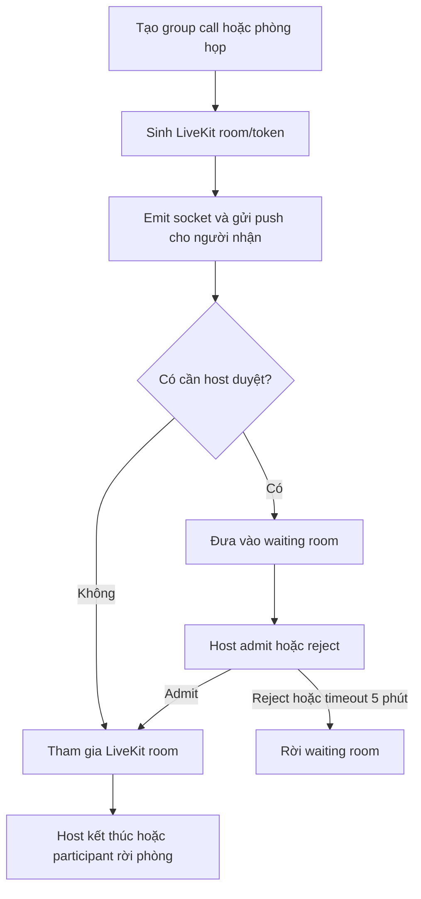

### 7. Reminder

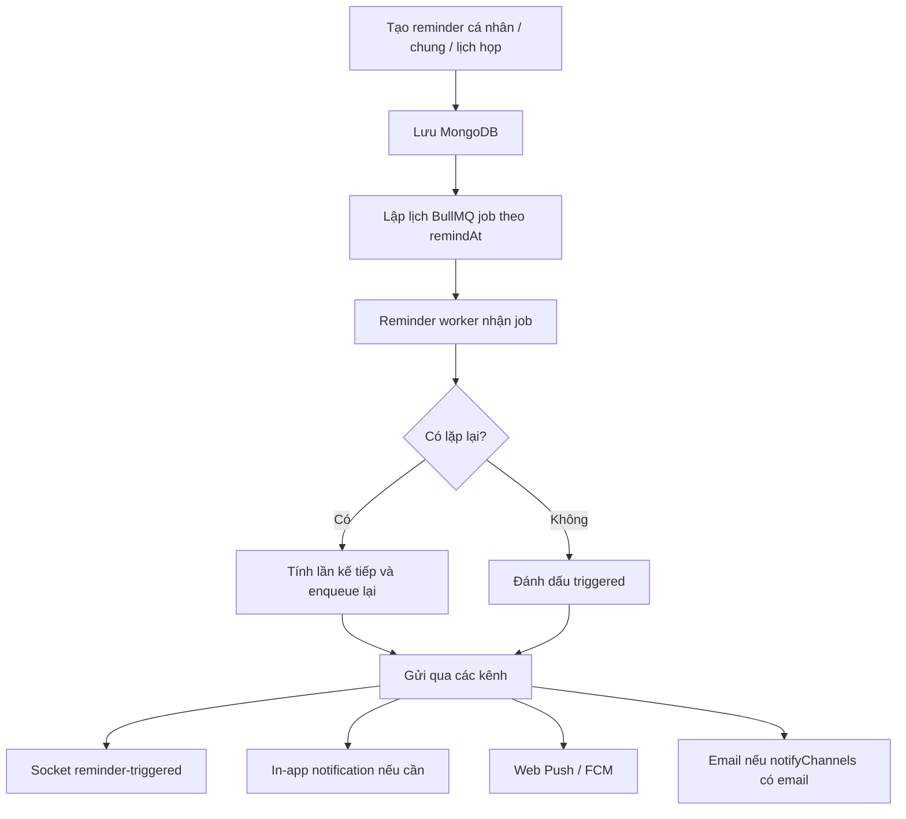

### 8. Moderation, report và kháng cáo

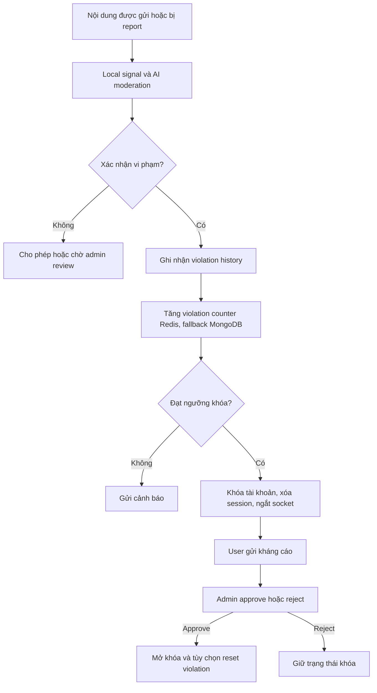

### 9. CI/CD

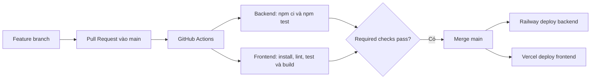

## API, realtime và worker

Backend expose REST API với prefix `/api`, ngoại trừ internal job endpoint.

### REST API module

| Module | Prefix | Mô tả |
| --- | --- | --- |
| Auth | `/api/auth` | Health check, signup, signin, signout, refresh token, Google OAuth, mobile Google auth, session và locked appeal |
| OTP | `/api/otp` | OTP đăng ký và đặt lại mật khẩu |
| Push | `/api/push` | VAPID key, Web Push subscription, FCM token và call action |
| Users | `/api/users` | Hồ sơ, avatar, trạng thái, moderation status, mật khẩu và Spotify music |
| Friends | `/api/friends` | Lời mời, danh sách bạn bè, gợi ý, nickname, block/unblock |
| Search | `/api/search` | Global search thường và NDJSON stream |
| Messages | `/api/messages` | Gửi, recall, pin, reaction, forward, mention, search và signed media URL |
| Conversations | `/api/conversations` | Direct/group chat, message paging, media, read state, mute, pin và quản lý nhóm |
| Disappearing messages | `/api/dm` | Setting, screenshot report và admin expire |
| Notifications | `/api/notifications` | Danh sách và trạng thái notification |
| LiveKit | `/api/livekit` | Token, room info và end meeting |
| Meetings | `/api/meetings` | Tạo, join, xem và kết thúc phòng họp |
| Reminders | `/api/reminders` | Reminder cá nhân, shared reminder và lịch họp |
| Reports | `/api/reports` | Tạo report tin nhắn/user và lịch sử report |
| Admin | `/api/admin` | Stats, observability, user inspection, report review, violation, lock/unlock và appeal |
| Internal disappearing job | `/internal/dm/expire-batch` | Trigger expiry batch với `x-internal-job-secret` |

### Socket.IO event chính

| Nhóm | Event tiêu biểu |
| --- | --- |
| Presence và session | `online-users`, `profile-updated`, `session-revoked` |
| Chat | `new-message`, `read-message`, `message-delivered`, `message-delivered-ack`, `recall-message`, `pin-message`, `message-reaction` |
| Typing và mention | `typing`, `stop-typing`, `user-typing`, `user-stopped-typing`, `user_mentioned` |
| Friend | `new-friend-request`, `friend-request-accepted`, `friend-request-rejected`, `unfriended`, `user-blocked`, `user-unblocked` |
| Conversation và group | `conversation-updated`, `conversation-cleared`, `members-added`, `member-removed`, `admin-transferred`, `group-disbanded` |
| Direct call | `call-offer`, `incoming-call`, `accept-call`, `call-answer`, `call-connected`, `call-rejected`, `call-ended` |
| Group call | `group-call:start`, `group-call:incoming`, `group-call:join`, `group-call:token`, `group-call:user-joined`, `group-call:ended` |
| Meeting waiting room | `waiting-room-update`, `participant-admitted`, `participant-rejected` |
| Reminder | `reminder-created`, `reminder-triggered`, `reminder-snoozed`, `reminder-updated`, `reminder-deleted` |
| Notification | `new-notification`, `notification-updated`, `notifications-all-read`, `notification-deleted` |
| Disappearing messages | `dm:disappearing-setting-updated`, `dm:message-expired`, `dm:screenshot-detected` |

### Worker và queue

| Queue | Worker | Vai trò |
| --- | --- | --- |
| `reminder` | `reminderWorker.js` | Trigger reminder, reschedule repeat reminder và gửi notification |
| `realtime-timeout` | `realtimeTimeoutWorker.js` | Timeout direct call, group call ring và meeting waiting room |
| `group-cleanup` | `groupCleanupWorker.js` | Xóa dữ liệu nhóm sau retention 30 ngày |
| `conversation-clear-cleanup` | `conversationClearCleanupWorker.js` | Xóa vật lý message đã được mọi participant clear |
| `dm-disappearing-expiry` | `disappearingMessageWorker.js` | Mỗi phút tự tắt mode quá hạn và expire message đến hạn |

Backend mặc định có thể chạy inline các worker cùng server. Có thể tách process bằng script:

```bash
cd backend
npm run worker:group-cleanup
npm run worker:conversation-clear-cleanup
npm run worker:dm-disappearing-expiry
```

Khi tách worker, đặt các biến `ENABLE_INLINE_*_WORKER=false` tương ứng trên server để tránh chạy trùng.

## Công nghệ

| Layer | Công nghệ |
| --- | --- |
| Frontend | React 19, TypeScript, Vite 7, Tailwind CSS, Radix UI, Zustand, Axios |
| Mobile | Capacitor 8, Android native bridge, Firebase Messaging, local notifications |
| Backend | Node.js, Express 5, Mongoose, JWT, Passport Google OAuth |
| Realtime | Socket.IO, Socket.IO Redis Adapter, LiveKit |
| Database | MongoDB Atlas hoặc MongoDB local |
| Cache, state và queue | Redis, ioredis, node-redis, BullMQ |
| Media | Cloudinary authenticated assets và signed URL |
| Notification | In-app notification, Web Push, Firebase Admin / FCM, Brevo email |
| AI và audio | Google Gemini, AssemblyAI |
| Testing | Node.js built-in test runner, Vitest |
| CI/CD | GitHub Actions, Railway, Vercel |
| Container | Docker, Docker Compose, Nginx |

## Cấu trúc thư mục

```text
NexCon/
├── .github/
│   └── workflows/
│       └── ci.yml
├── backend/
│   ├── src/
│   │   ├── config/          # MongoDB, Redis, BullMQ, Firebase, Passport
│   │   ├── controllers/     # REST controllers
│   │   ├── middlewares/     # Auth, role, rate limit, upload, audit log
│   │   ├── migrations/      # Migration scripts
│   │   ├── models/          # Mongoose models
│   │   ├── routes/          # Express routes
│   │   ├── services/        # Moderation, presence, push, call state
│   │   ├── socket/          # Socket.IO gateway và call handlers
│   │   ├── utils/           # Crypto, helper, privacy, mentions
│   │   ├── workers/         # BullMQ workers và runners
│   │   └── server.js
│   ├── test/
│   ├── Dockerfile
│   └── package.json
├── frontend/
│   ├── android/             # Capacitor Android project và native bridge
│   ├── public/              # Logo, service worker, sound assets
│   ├── src/
│   │   ├── components/
│   │   ├── hooks/
│   │   ├── layouts/
│   │   ├── lib/
│   │   ├── pages/
│   │   ├── services/
│   │   ├── stores/
│   │   ├── types/
│   │   └── utils/
│   ├── tests/
│   ├── Dockerfile
│   └── package.json
├── docs/
│   ├── ci-cd-quy-trinh.md
│   └── dm-disappearing-messages.md
├── docker-compose.yml
└── README.md
```

## Cài đặt và chạy local

### Yêu cầu

| Công cụ | Phiên bản khuyến nghị |
| --- | --- |
| Node.js | 22.x để đồng nhất CI |
| npm | 10.x hoặc mới hơn |
| MongoDB | MongoDB Atlas hoặc MongoDB local |
| Redis | Redis local hoặc Docker Redis |
| Docker | Tùy chọn |
| LiveKit Server | Tùy chọn khi cần test call/meeting |

### 1. Clone repository

```bash
git clone https://github.com/ToiLaBao2004/NexCon.git
cd NexCon
```

### 2. Tạo biến môi trường backend

Tạo `backend/.env`:

```env
# Server
PORT=5001
CLIENT_URL=http://localhost:5173
FRONTEND_URL=http://localhost:5173
BACKEND_URL=http://localhost:5001
TRUST_PROXY=

# Database, Redis và crypto
MONGODB_CONNECTION_STRING=mongodb://127.0.0.1:27017/nexcon
MONGODB_MAX_POOL_SIZE=30
REDIS_URL=redis://127.0.0.1:6379
ACCESS_TOKEN_SECRET=replace_with_a_strong_secret
MESSAGE_ENCRYPTION_KEY=base64:<32-byte-key-in-base64>

# Google OAuth
GOOGLE_CLIENT_ID=
GOOGLE_CLIENT_SECRET=

# Cloudinary
CLOUDINARY_CLOUD_NAME=
CLOUDINARY_API_KEY=
CLOUDINARY_API_SECRET=

# LiveKit
LIVEKIT_API_KEY=devkey
LIVEKIT_API_SECRET=secret

# Web Push
VAPID_PUBLIC_KEY=
VAPID_PRIVATE_KEY=
VAPID_MAILTO=mailto:admin@example.com

# Android FCM: JSON service account ở dạng một dòng
FIREBASE_SERVICE_ACCOUNT=

# Moderation, audio và Spotify
GEMINI_API_KEY=
ASSEMBLYAI_API_KEY=
SPOTIFY_CLIENT_ID=
SPOTIFY_CLIENT_SECRET=

# Email OTP và reminder
BREVO_API_URL=
BREVO_API_KEY=
EMAIL_FROM_EMAIL=
EMAIL_FROM_NAME=NexCon App

# Internal job endpoint
INTERNAL_JOB_SECRET=
```

Các integration key có thể để trống nếu không test tính năng tương ứng. Với môi trường production,
không dùng fallback mặc định cho `MESSAGE_ENCRYPTION_KEY`.

Biến vận hành tùy chọn:

```env
ENABLE_INLINE_GROUP_CLEANUP_WORKER=true
ENABLE_INLINE_CONVERSATION_CLEAR_CLEANUP_WORKER=true
ENABLE_INLINE_DISAPPEARING_MESSAGE_WORKER=true

SOCKET_PRESENCE_TTL_SECONDS=120
PRESENCE_FLUSH_DELAY_MS=2000
SOCKET_SESSION_REVALIDATE_MS=60000
DIRECT_CALL_STATE_TTL_SECONDS=7200
GROUP_CALL_STATE_TTL_SECONDS=21600

AUDIT_LOG_ENABLED=true
AUDIT_LOG_FLUSH_MS=1000
AUDIT_LOG_MAX_BATCH_SIZE=500
SLOW_API_LOG_MS=1000
```

### 3. Tạo biến môi trường frontend

Tạo `frontend/.env`:

```env
VITE_API_URL=http://localhost:5001/api
VITE_SOCKET_URL=http://localhost:5001
VITE_LIVEKIT_URL=ws://localhost:7880
VITE_VAPID_PUBLIC_KEY=
VITE_CONNECTIVITY_CHECK_URL=http://localhost:5001/api/auth/health
VITE_STICKER_ASSET_VERSION=2026-05-18
```

### 4. Cài dependencies

Backend:

```bash
cd backend
npm ci
```

Frontend:

```bash
cd frontend
npm ci --legacy-peer-deps
```

Frontend hiện cần `--legacy-peer-deps` do dependency tree của Capacitor.

### 5. Chạy Redis và LiveKit local

Cách nhanh bằng Docker:

```bash
docker run --name nexcon-redis -p 6379:6379 -d redis:7-alpine
docker run --name nexcon-livekit -p 7880:7880 -p 7881:7881 -p 7882:7882/udp -d livekit/livekit-server:latest --dev --bind 0.0.0.0
```

### 6. Chạy backend và frontend

Terminal backend:

```bash
cd backend
npm run dev
```

Terminal frontend:

```bash
cd frontend
npm run dev
```

Địa chỉ mặc định:

| Thành phần | URL |
| --- | --- |
| Frontend | `http://localhost:5173` |
| Backend | `http://localhost:5001` |
| Health check | `http://localhost:5001/api/auth/health` |
| LiveKit | `ws://localhost:7880` |

### 7. Chạy bằng Docker Compose

Tạo `.env` ở root repository cho các biến Docker Compose cần đọc, sau đó chạy:

```bash
docker compose up --build
```

Compose hiện khởi động:

- Redis.
- LiveKit dev server.
- Backend API.
- Dedicated `group-cleanup-worker`.
- Frontend qua Nginx.

Server vẫn chạy inline reminder worker, realtime timeout worker, conversation-clear worker và
disappearing-message worker. Khi mở rộng Compose bằng worker process riêng, tắt inline worker tương ứng.

### 8. Migration disappearing messages

Với database đã tồn tại trước feature disappearing messages:

```bash
cd backend
npm run migrate:dm-disappearing
```

### 9. Android

Frontend đã chứa project Capacitor Android trong `frontend/android/`.

```bash
cd frontend
npm run build
npx cap sync android
npx cap open android
```

Để dùng FCM trên Android:

1. Đặt `google-services.json` vào `frontend/android/app/`.
2. Cấu hình `FIREBASE_SERVICE_ACCOUNT` trên backend.
3. Build và chạy app bằng Android Studio.

Screenshot detection dùng `ScreenCaptureCallback`, nên chỉ hoạt động từ Android 14 trở lên.

## Kiểm thử và CI/CD

### Backend test

```bash
cd backend
npm test
```

Test hiện có:

```text
backend/test/fieldFormat.test.js
backend/test/isMuted.test.js
backend/test/mentions.test.js
backend/test/moderationPromptService.test.js
backend/test/userStatusService.test.js
backend/test/disappearingMessages.test.js
```

### Frontend test

```bash
cd frontend
npm test
```

Test hiện có:

```text
frontend/tests/fieldFormat.test.ts
frontend/tests/meetingLink.test.ts
frontend/tests/mentions.test.ts
frontend/tests/disappearingMessages.test.ts
```

### Build và lint

```bash
cd frontend
npm run lint
npm run build
```

### GitHub Actions

Workflow CI nằm tại [`.github/workflows/ci.yml`](./.github/workflows/ci.yml) và chạy khi:

- Push vào `main`.
- Pull Request vào `main`.

| Job | Lệnh chính | Ghi chú |
| --- | --- | --- |
| Backend | `npm ci`, `npm test` | Test backend bằng Node.js test runner |
| Frontend | `npm ci --legacy-peer-deps`, `npm run lint`, `npm test`, `npm run build` | Lint hiện dùng `continue-on-error: true`; test và build vẫn bắt buộc pass |

Tài liệu CI/CD chi tiết: [docs/ci-cd-quy-trinh.md](./docs/ci-cd-quy-trinh.md).

## Deploy

### Frontend trên Vercel

| Cấu hình | Giá trị |
| --- | --- |
| Root Directory | `frontend` |
| Install Command | `npm ci --legacy-peer-deps` |
| Build Command | `npm run build` |
| Output Directory | `dist` |

Biến môi trường tối thiểu:

```env
VITE_API_URL=https://<backend-domain>/api
VITE_SOCKET_URL=https://<backend-domain>
VITE_LIVEKIT_URL=wss://<livekit-domain>
VITE_VAPID_PUBLIC_KEY=
VITE_CONNECTIVITY_CHECK_URL=https://<backend-domain>/api/auth/health
```

### Backend trên Railway

| Cấu hình | Giá trị |
| --- | --- |
| Root Directory | `backend` |
| Install Command | `npm ci` |
| Start Command | `npm start` |
| Health check | `/api/auth/health` |

Production cần cấu hình MongoDB, Redis, crypto secret, CORS URL và key của các integration thực sự sử dụng.
Tất cả backend replica và worker process phải dùng cùng `MONGODB_CONNECTION_STRING`, `REDIS_URL`
và `MESSAGE_ENCRYPTION_KEY`.

### LiveKit

Call và meeting yêu cầu LiveKit server riêng. Frontend dùng WebSocket URL qua `VITE_LIVEKIT_URL`;
backend dùng `LIVEKIT_API_KEY` và `LIVEKIT_API_SECRET` để phát token.

## Bảo mật và vận hành

- Không commit `.env`, Firebase service account, `google-services.json`, keystore hoặc private key.
- Dùng secret đủ mạnh và ổn định cho `ACCESS_TOKEN_SECRET` và `MESSAGE_ENCRYPTION_KEY`.
- Không thay đổi `MESSAGE_ENCRYPTION_KEY` tùy tiện sau khi đã có dữ liệu mã hóa.
- Bật HTTPS/WSS ở production.
- Cấu hình `CLIENT_URL` chính xác để giới hạn CORS.
- Cấu hình `TRUST_PROXY` khi backend chạy sau reverse proxy.
- Tất cả replica phải dùng cùng Redis để Socket.IO adapter, presence, call state và queue nhất quán.
- Nếu Socket.IO cho phép HTTP long-polling fallback qua load balancer, cấu hình sticky session hoặc ép WebSocket transport nhất quán.
- Theo dõi admin observability, audit log, worker error và Redis connectivity.
- Internal expiry endpoint `/internal/dm/expire-batch` phải được bảo vệ bằng `INTERNAL_JOB_SECRET`.
- Cloudinary message assets dùng authenticated delivery; client chỉ nhận signed URL tạm thời.
- Audit log được batch insert và TTL 60 ngày; notification TTL 30 ngày; ended meeting TTL 7 ngày.

## Tài liệu liên quan

- [Quy trình CI/CD](./docs/ci-cd-quy-trinh.md)
- [Disappearing messages](./docs/dm-disappearing-messages.md)
- [Frontend README](./frontend/README.md)
- [GitHub Actions workflow](./.github/workflows/ci.yml)
- [Docker Compose](./docker-compose.yml)

---

<div align="center">
  <strong>NexCon</strong>
  <br />
  Realtime communication, collaboration and safer community management.
</div>
