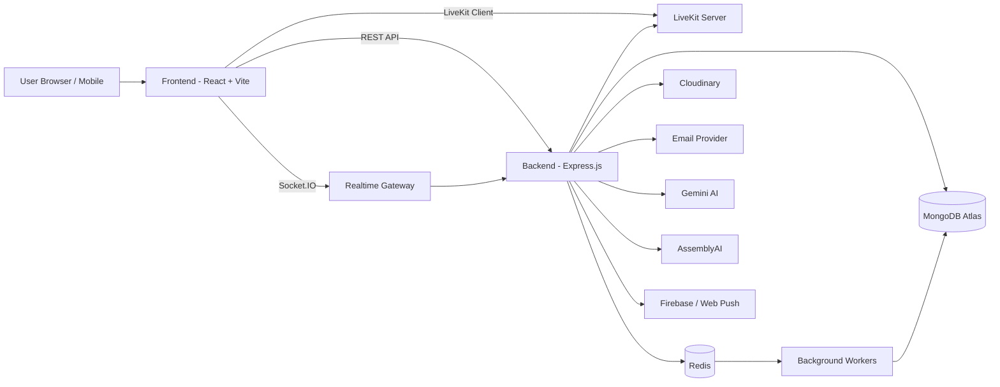

<div align="center">
  

  <h1>NexCon</h1>

  <p>
    Nền tảng kết nối, trò chuyện, gọi audio/video và quản lý cộng đồng theo thời gian thực.
  </p>

  <p>
    <a href="https://github.com/ToiLaBao2004/NexCon/actions/workflows/ci.yml">
      
    </a>
    
    
    
    
  </p>
</div>

---

## 📌 Giới thiệu

**NexCon** là ứng dụng mạng xã hội/chat realtime được xây dựng theo mô hình full-stack, hỗ trợ nhắn tin cá nhân, nhóm chat, gọi audio/video, nhắc hẹn, thông báo đẩy, quản trị nội dung và kiểm duyệt an toàn cộng đồng.

Dự án được thiết kế theo hướng production-ready với:

- Frontend triển khai trên **Vercel**.
- Backend triển khai trên **Railway**.
- Database sử dụng **MongoDB Atlas**.
- CI tự động bằng **GitHub Actions**.
- CD tự động thông qua Railway/Vercel khi nhánh `main` được cập nhật.

---

## 🎯 Mục tiêu dự án

NexCon hướng tới việc xây dựng một nền tảng giao tiếp hiện đại, nơi người dùng có thể:

| Mục tiêu            | Mô tả                                                           |
| ------------------- | --------------------------------------------------------------- |
| Kết nối người dùng  | Tìm kiếm, kết bạn, chặn người dùng và quản lý mối quan hệ       |
| Trò chuyện realtime | Nhắn tin cá nhân, nhóm, sticker, media, reaction, ghim tin nhắn |
| Gọi trực tuyến      | Audio/video call cá nhân và nhóm thông qua LiveKit              |
| Quản lý lịch nhắc   | Tạo reminder cá nhân/nhóm, lịch họp, thông báo nhắc hẹn         |
| Bảo mật tài khoản   | JWT, refresh token, Google OAuth, OTP, quản lý phiên đăng nhập  |
| Quản trị hệ thống   | Admin dashboard, report, lock appeal, moderation, audit log     |
| Kiểm duyệt nội dung | AI moderation cho text/link/image và lưu ngữ cảnh training      |

---

## ✨ Tính năng nổi bật

- 🔐 **Authentication & Authorization**
  - Đăng ký, đăng nhập, refresh token.
  - Google OAuth.
  - OTP xác minh tài khoản và đặt lại mật khẩu.
  - Phân quyền user/admin.

- 💬 **Realtime Chat**
  - Chat 1-1 và group chat.
  - Socket.IO realtime event.
  - Gửi ảnh, sticker, emoji, voice/audio.
  - Reaction, pin/unpin message, forward message.
  - Xóa/làm sạch hội thoại theo lịch.

- 📞 **Audio/Video Meeting**
  - Tích hợp LiveKit.
  - Gọi cá nhân, gọi nhóm, phòng chờ, incoming/outgoing call modal.
  - Meeting room bằng mã phòng.

- 🔔 **Notification & Reminder**
  - In-app notification.
  - Push notification qua Web Push/Firebase.
  - Reminder cá nhân và reminder chung trong nhóm.
  - Worker xử lý lịch nhắc.

- 🛡️ **Moderation & Admin**
  - Báo cáo nội dung/người dùng.
  - Admin review report, xử lý appeal.
  - AI moderation cho text, link, image.
  - Violation tracking, lock user, audit log.

- 📱 **Cross-platform Ready**
  - Web app bằng React.
  - Có tích hợp Capacitor cho hướng mobile/native.

---

## 🏗️ Kiến trúc hệ thống



### Frontend

Frontend nằm trong thư mục:

```text
frontend/
```

Vai trò chính:

- Render giao diện người dùng.
- Quản lý state bằng Zustand.
- Gọi REST API bằng Axios.
- Kết nối realtime bằng Socket.IO Client.
- Tích hợp LiveKit UI/client cho audio/video call.
- Build production bằng Vite.

### Backend

Backend nằm trong thư mục:

```text
backend/
```

Vai trò chính:

- Cung cấp REST API.
- Xử lý xác thực, phân quyền và session.
- Quản lý realtime gateway bằng Socket.IO.
- Kết nối MongoDB, Redis, Cloudinary, LiveKit, Firebase/Web Push.
- Chạy worker cho reminder, group cleanup và conversation cleanup.
- Kiểm duyệt nội dung và quản trị hệ thống.

---

## 🧰 Công nghệ sử dụng

| Layer         | Công nghệ                                                     |
| ------------- | ------------------------------------------------------------- |
| Frontend      | React 19, Vite 7, TypeScript, Tailwind CSS, Radix UI, Zustand |
| Realtime      | Socket.IO, LiveKit                                            |
| Mobile bridge | Capacitor                                                     |
| Backend       | Node.js, Express 5, Mongoose, JWT, Passport Google OAuth      |
| Database      | MongoDB Atlas                                                 |
| Queue/Cache   | Redis, BullMQ                                                 |
| Media Storage | Cloudinary                                                    |
| Notification  | Firebase Admin, Web Push                                      |
| AI/Moderation | Google Gemini, AssemblyAI                                     |
| Testing       | Node Test Runner, Vitest                                      |
| CI/CD         | GitHub Actions, Vercel, Railway                               |
| Container     | Docker, Docker Compose, Nginx                                 |

---

## 📁 Cấu trúc thư mục

```text
NexCon/
├── .github/
│   └── workflows/
│       └── ci.yml
├── backend/
│   ├── src/
│   │   ├── config/
│   │   ├── controllers/
│   │   ├── middlewares/
│   │   ├── models/
│   │   ├── routes/
│   │   ├── services/
│   │   ├── socket/
│   │   ├── utils/
│   │   ├── workers/
│   │   └── server.js
│   ├── test/
│   ├── Dockerfile
│   ├── package.json
│   └── package-lock.json
├── frontend/
│   ├── public/
│   ├── src/
│   │   ├── components/
│   │   ├── hooks/
│   │   ├── layouts/
│   │   ├── lib/
│   │   ├── pages/
│   │   ├── services/
│   │   ├── stores/
│   │   ├── types/
│   │   └── utils/
│   ├── tests/
│   ├── Dockerfile
│   ├── package.json
│   ├── vercel.json
│   └── vite.config.ts
├── docs/
│   └── ci-cd-quy-trinh.md
├── docker-compose.yml
└── README.md
```

---

## 🚀 Cài đặt và chạy local

### Yêu cầu môi trường

| Công cụ | Phiên bản khuyến nghị            |
| ------- | -------------------------------- |
| Node.js | 22.x                             |
| npm     | 10.x hoặc mới hơn                |
| Docker  | Tuỳ chọn                         |
| MongoDB | MongoDB Atlas hoặc local MongoDB |
| Redis   | Local Redis hoặc Docker Redis    |

### 1. Clone repository

```bash
git clone https://github.com/ToiLaBao2004/NexCon.git
cd NexCon
```

### 2. Cấu hình biến môi trường backend

Tạo file:

```text
backend/.env
```

Ví dụ:

```env
PORT=5001
CLIENT_URL=http://localhost:5173
FRONTEND_URL=http://localhost:5173
BACKEND_URL=http://localhost:5001

MONGODB_CONNECTION_STRING=mongodb+srv://<user>:<password>@<cluster>/<database>
ACCESS_TOKEN_SECRET=replace_with_strong_secret
MESSAGE_ENCRYPTION_KEY=replace_with_32_bytes_secret

GOOGLE_CLIENT_ID=
GOOGLE_CLIENT_SECRET=

CLOUDINARY_CLOUD_NAME=
CLOUDINARY_API_KEY=
CLOUDINARY_API_SECRET=

REDIS_URL=redis://127.0.0.1:6379

LIVEKIT_API_KEY=devkey
LIVEKIT_API_SECRET=secret

VAPID_PUBLIC_KEY=
VAPID_PRIVATE_KEY=
VAPID_MAILTO=mailto:admin@example.com

GEMINI_API_KEY=
ASSEMBLYAI_API_KEY=

BREVO_API_URL=
BREVO_API_KEY=
EMAIL_FROM_EMAIL=
EMAIL_FROM_NAME=NexCon App
```

### 3. Cấu hình biến môi trường frontend

Tạo file:

```text
frontend/.env
```

Ví dụ:

```env
VITE_API_URL=http://localhost:5001/api
VITE_SOCKET_URL=http://localhost:5001
VITE_LIVEKIT_URL=ws://localhost:7880
VITE_VAPID_PUBLIC_KEY=
VITE_CONNECTIVITY_CHECK_URL=http://localhost:5001/api/auth/health
VITE_STICKER_ASSET_VERSION=2026-05-18
```

### 4. Cài dependencies

Backend:

```bash
cd backend
npm ci
```

Frontend:

```bash
cd frontend
npm ci --legacy-peer-deps
```

> Frontend hiện cần `--legacy-peer-deps` do một số package Capacitor có peer dependency chưa đồng bộ hoàn toàn.

### 5. Chạy backend

```bash
cd backend
npm run dev
```

Backend mặc định chạy tại:

```text
http://localhost:5001
```

### 6. Chạy frontend

```bash
cd frontend
npm run dev
```

Frontend mặc định chạy tại:

```text
http://localhost:5173
```

### 7. Chạy bằng Docker Compose

```bash
docker compose up --build
```

Docker Compose sẽ khởi động:

- Redis.
- LiveKit dev server.
- Backend.
- Background worker.
- Frontend qua Nginx.

---

## 🧪 Testing

Backend:

```bash
cd backend
npm test
```

Frontend:

```bash
cd frontend
npm test
```

Build frontend production:

```bash
cd frontend
npm run build
```

Lint frontend:

```bash
cd frontend
npm run lint
```

> Lưu ý: lint hiện vẫn còn lỗi legacy trong codebase, nên CI đang chạy lint ở chế độ báo cáo và chưa chặn merge.

---

## 🔄 CI/CD workflow

CI được cấu hình tại:

```text
.github/workflows/ci.yml
```

Workflow chạy khi:

- Có Pull Request vào `main`.
- Có push lên `main`.

### Các job CI

| Job           | Lệnh chính                                               | Mục đích                              |
| ------------- | -------------------------------------------------------- | ------------------------------------- |
| Backend       | `npm ci`, `npm test`                                     | Cài backend dependencies và chạy test |
| Frontend      | `npm ci --legacy-peer-deps`, `npm test`, `npm run build` | Test và build frontend                |
| Frontend lint | `npm run lint`                                           | Báo cáo lint, chưa chặn merge         |

### Quy trình chuẩn

```text
feature branch
→ Pull Request vào main
→ GitHub Actions chạy Backend + Frontend checks
→ Checks pass
→ Merge vào main
→ Railway deploy backend
→ Vercel deploy frontend
```

Chi tiết hơn xem:

```text
docs/ci-cd-quy-trinh.md
```

---

## 🌐 Deploy

### Frontend - Vercel

Thiết lập Vercel:

| Cấu hình         | Giá trị                     |
| ---------------- | --------------------------- |
| Root Directory   | `frontend`                  |
| Build Command    | `npm run build`             |
| Output Directory | `dist`                      |
| Install Command  | `npm ci --legacy-peer-deps` |

Environment variables cần cấu hình trên Vercel:

```env
VITE_API_URL=https://<railway-backend-domain>/api
VITE_SOCKET_URL=https://<railway-backend-domain>
VITE_LIVEKIT_URL=wss://<livekit-domain>
VITE_VAPID_PUBLIC_KEY=
```

### Backend - Railway

Thiết lập Railway:

| Cấu hình       | Giá trị     |
| -------------- | ----------- |
| Root Directory | `backend`   |
| Start Command  | `npm start` |
| Runtime        | Node.js     |

Environment variables cần cấu hình trên Railway:

```env
PORT=5001
CLIENT_URL=https://<vercel-frontend-domain>
FRONTEND_URL=https://<vercel-frontend-domain>
BACKEND_URL=https://<railway-backend-domain>
MONGODB_CONNECTION_STRING=
ACCESS_TOKEN_SECRET=
REDIS_URL=
CLOUDINARY_CLOUD_NAME=
CLOUDINARY_API_KEY=
CLOUDINARY_API_SECRET=
LIVEKIT_API_KEY=
LIVEKIT_API_SECRET=
```

---

## 🗄️ Database và service liên quan

| Service              | Vai trò                                                                      |
| -------------------- | ---------------------------------------------------------------------------- |
| MongoDB Atlas        | Lưu user, session, conversation, message, notification, reminder, report     |
| Redis                | Cache/queue cho worker, reminder, cleanup và realtime-related background job |
| Cloudinary           | Lưu media, ảnh, file upload                                                  |
| LiveKit              | Audio/video room và meeting realtime                                         |
| Firebase Admin       | Push notification / FCM                                                      |
| Web Push             | Push notification trên web                                                   |
| Gemini AI            | Kiểm duyệt text/link/image                                                   |
| AssemblyAI           | Transcribe audio                                                             |
| Brevo/Email Provider | Gửi email OTP, thông báo và appeal                                           |

---

## 🧩 API và module chính

Backend expose API với prefix `/api`.

| Module        | Prefix               | Mô tả                                                    |
| ------------- | -------------------- | -------------------------------------------------------- |
| Auth          | `/api/auth`          | Đăng ký, đăng nhập, Google OAuth, refresh token, session |
| OTP           | `/api/otp`           | OTP tạo tài khoản và đặt lại mật khẩu                    |
| Push          | `/api/push`          | Đăng ký push subscription                                |
| Admin         | `/api/admin`         | Dashboard admin, report review, user management          |
| Users         | `/api/users`         | Hồ sơ người dùng, cập nhật thông tin                     |
| Friends       | `/api/friends`       | Kết bạn, lời mời, danh sách bạn bè, block                |
| Messages      | `/api/messages`      | Gửi, đọc, tìm kiếm, reaction, media message              |
| Conversations | `/api/conversations` | Quản lý hội thoại cá nhân và nhóm                        |
| Notifications | `/api/notifications` | Thông báo trong ứng dụng                                 |
| LiveKit       | `/api/livekit`       | Token và cấu hình LiveKit                                |
| Meetings      | `/api/meetings`      | Tạo, join, kết thúc meeting                              |
| Reminders     | `/api/reminders`     | Reminder cá nhân/nhóm                                    |
| Reports       | `/api/reports`       | Report nội dung/người dùng và lịch sử report             |

### Socket modules

| Module                       | Vai trò                   |
| ---------------------------- | ------------------------- |
| `socket/index.js`            | Khởi tạo Socket.IO server |
| `socket/socketGateway.js`    | Điều phối realtime events |
| `socket/callHandler.js`      | Call cá nhân              |
| `socket/groupCallHandler.js` | Group call                |

### Background workers

| Worker                            | Script                                      |
| --------------------------------- | ------------------------------------------- |
| Reminder worker                   | `backend/src/workers/reminderWorker.js`     |
| Group cleanup worker              | `npm run worker:group-cleanup`              |
| Conversation clear cleanup worker | `npm run worker:conversation-clear-cleanup` |

---

## 🖼️ Hình ảnh minh hoạ / Demo

> Thêm screenshot thật vào thư mục `docs/assets/` khi có bản demo ổn định.

| Màn hình          | Preview                      |
| ----------------- | ---------------------------- |
| Sign in / Sign up | `docs/assets/demo-auth.png`  |
| Chat realtime     | `docs/assets/demo-chat.png`  |
| Group call        | `docs/assets/demo-call.png`  |
| Admin dashboard   | `docs/assets/demo-admin.png` |

```md

```

---

## 🛡️ Bảo mật và vận hành

- Không commit file `.env`, service account hoặc private key.
- Dùng `httpOnly cookie`/refresh token flow cho web và secure storage qua Capacitor Preferences cho mobile.
- Bật branch ruleset cho `main` để bắt buộc CI pass trước khi merge.
- Cấu hình CORS bằng `CLIENT_URL`.
- Cấu hình rate limit cho auth, OTP và API chung.
- Theo dõi log deploy trên Railway/Vercel sau mỗi lần merge.

---

## 🗺️ Định hướng phát triển tương lai

- [ ] Chuẩn hoá toàn bộ lint và bật lint thành required check trong CI.
- [ ] Bổ sung test integration cho auth, chat, conversation và admin.
- [ ] Thêm E2E test cho các flow chính bằng Playwright/Cypress.
- [ ] Tối ưu bundle frontend và code splitting.
- [ ] Hoàn thiện mobile build với Capacitor.
- [ ] Bổ sung observability: structured logging, metrics, alerting.
- [ ] Tối ưu moderation workflow và dashboard review.
- [ ] Bổ sung tài liệu API chi tiết bằng OpenAPI/Swagger.

---

## 👥 Nhóm phát triển

| Vai trò            | Thành viên               | Ghi chú                         |
| ------------------ | ------------------------ | ------------------------------- |
| Project Owner      | ToiLaBao2004             | GitHub maintainer               |
| Frontend Developer | ToiLaBao2004, Tnthien204 | React/Vite UI                   |
| Backend Developer  | ToiLaBao2004, Tnthien204 | Express/Socket.IO/API           |
| DevOps/CI-CD       | ToiLaBao2004             | Railway, Vercel, GitHub Actions |
| QA/Tester          | Tnthien204               | Test plan, regression test      |

---

## 📚 Tài liệu liên quan

- [Quy trình CI/CD](./docs/ci-cd-quy-trinh.md)
- [Frontend README](./frontend/README.md)
- [GitHub Actions workflow](./.github/workflows/ci.yml)
- [Docker Compose](./docker-compose.yml)

---

<div align="center">
  <strong>NexCon</strong>
  <br />
  Built for realtime communication, safer communities and production-ready learning.
</div>
