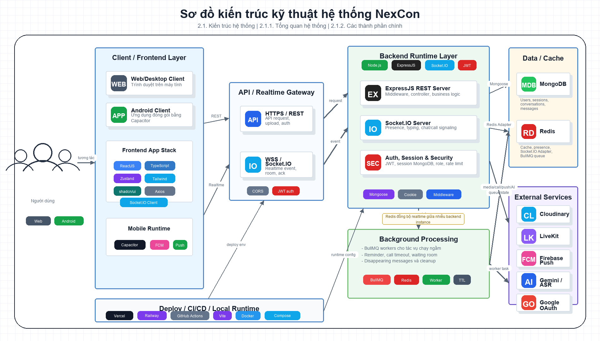

# CHƯƠNG 2. CƠ SỞ LÝ THUYẾT VÀ CÔNG NGHỆ SỬ DỤNG

## 2.1. Kiến trúc hệ thống

_Hình 2.1. Kiến trúc tổng quan và các thành phần công nghệ sử dụng trong NexCon_

### 2.1.1. Tổng quan hệ thống

NexCon, viết tắt từ Next Generation Connection, là ứng dụng web giao tiếp thời gian thực phục vụ các nhu cầu nhắn tin, gọi thoại, gọi video, tạo phòng họp, gửi tệp, gửi ảnh, nhắc hẹn và quản lý thông báo. Đề tài được xây dựng theo hướng ứng dụng thực tế, trong đó người dùng có thể đăng ký, đăng nhập, kết bạn, trò chuyện cá nhân, tạo nhóm, gọi trực tuyến và nhận các cập nhật mới gần như ngay lập tức.

Về mặt kiến trúc, hệ thống được tổ chức theo mô hình client-server. Phía client chịu trách nhiệm hiển thị giao diện, quản lý trạng thái người dùng, gửi yêu cầu API và nhận sự kiện realtime. Phía server xử lý nghiệp vụ, xác thực, phân quyền, lưu trữ dữ liệu, phát sự kiện thời gian thực và kết nối với các dịch vụ ngoài. Cách tổ chức này giúp tách biệt phần giao diện và phần xử lý nghiệp vụ, từ đó thuận lợi hơn trong quá trình phát triển, kiểm thử và triển khai.

Khác với website tĩnh chỉ hiển thị nội dung có sẵn, NexCon thuộc nhóm ứng dụng web động có tương tác cao. Dữ liệu trong hệ thống thay đổi liên tục theo hành động của người dùng, ví dụ như gửi tin nhắn, đọc tin, thay đổi trạng thái online, nhận cuộc gọi, tạo reminder hoặc cập nhật nhóm chat. Vì vậy, hệ thống không chỉ sử dụng REST API truyền thống mà còn kết hợp Socket.IO để xử lý giao tiếp hai chiều giữa client và server.

Trong môi trường production, frontend được triển khai trên Vercel dưới dạng Single Page Application build bằng Vite. Backend được triển khai trên Railway với 6 replicas nhằm tăng khả năng chịu tải và tính sẵn sàng. Vì backend chạy nhiều instance song song, hệ thống không được phụ thuộc vào bộ nhớ cục bộ của một process duy nhất, mà phải dùng MongoDB và Redis làm nguồn trạng thái chung.

### 2.1.2. Mô hình client-server kết hợp realtime

Mô hình client-server là mô hình phổ biến trong phát triển ứng dụng web. Client là nơi người dùng tương tác trực tiếp thông qua trình duyệt hoặc ứng dụng di động. Server là nơi tiếp nhận yêu cầu, kiểm tra quyền truy cập, xử lý logic nghiệp vụ và trả kết quả cho client. Trong NexCon, client chủ yếu giao tiếp với server qua hai cơ chế:

- REST API: dùng cho các thao tác cần xử lý dữ liệu rõ ràng như đăng nhập, đăng ký, lấy danh sách hội thoại, gửi tin nhắn, tải tệp, cập nhật hồ sơ, tạo reminder hoặc thao tác quản trị.
- Socket.IO: dùng cho các cập nhật thời gian thực như tin nhắn mới, typing indicator, trạng thái online, read receipt, delivered receipt, lời mời gọi, thông báo mới hoặc sự kiện thay đổi nhóm.

Đối với chức năng nhắn tin, hệ thống không gửi tin nhắn chính trực tiếp bằng socket. Frontend gửi tin qua REST API để backend có thể kiểm tra xác thực, kiểm tra quyền trong hội thoại, xử lý upload media, lưu MongoDB và cập nhật trạng thái hội thoại. Sau khi dữ liệu đã được lưu thành công, backend mới phát Socket.IO event đến các client liên quan. Cách tiếp cận này giúp MongoDB đóng vai trò là nguồn dữ liệu chính, còn Socket.IO đóng vai trò đồng bộ thay đổi tức thời đến giao diện.

Thiết kế này phù hợp với ứng dụng realtime vì vẫn giữ được tính nhất quán dữ liệu. Nếu client bị mất kết nối socket hoặc bỏ lỡ event, người dùng vẫn có thể tải lại danh sách hội thoại và tin nhắn thông qua REST API. Nói cách khác, realtime giúp trải nghiệm nhanh hơn, nhưng dữ liệu chính thức vẫn được lưu trong cơ sở dữ liệu.

### 2.1.3. Các thành phần chính của hệ thống

Hệ thống NexCon gồm các nhóm thành phần chính sau:

- Frontend web: xây dựng bằng ReactJS, TypeScript, Vite, Zustand, TailwindCSS và shadcn/ui. Thành phần này cung cấp giao diện cho chat, cuộc gọi, bạn bè, thông báo, reminder, báo cáo vi phạm và trang quản trị.
- Mobile runtime: sử dụng Capacitor để đóng gói ứng dụng web thành ứng dụng Android, đồng thời hỗ trợ các chức năng native như Firebase Messaging, local notification, Google Sign-In và incoming call screen.
- Backend API: xây dựng bằng Node.js và ExpressJS, cung cấp các API cho xác thực, người dùng, bạn bè, hội thoại, tin nhắn, cuộc gọi, meeting, reminder, notification, report và admin.
- Realtime gateway: sử dụng Socket.IO để duy trì kết nối hai chiều với client, phát các event realtime và đồng bộ trạng thái người dùng.
- Database: sử dụng MongoDB để lưu trữ dữ liệu chính của hệ thống như user, session, conversation, message, notification, reminder, meeting, report và audit log.
- Cache, state và queue: sử dụng Redis cho presence, call state, Socket.IO Redis Adapter, counter kiểm duyệt và BullMQ queue.
- Background worker: xử lý các tác vụ nền như reminder, timeout cuộc gọi, disappearing messages và cleanup dữ liệu.
- Dịch vụ bên ngoài: Cloudinary lưu trữ media, LiveKit xử lý audio/video realtime, Firebase Cloud Messaging và Web Push gửi thông báo, Google Gemini hỗ trợ kiểm duyệt nội dung, AssemblyAI hỗ trợ chuyển giọng nói thành văn bản.

### 2.1.4. Kiến trúc nhiều replicas trên Railway

Khi backend được triển khai 6 replicas trên Railway, mỗi kết nối WebSocket của người dùng chỉ gắn với một replica tại một thời điểm. Nếu hệ thống chỉ lưu socket ID, danh sách online hoặc trạng thái cuộc gọi trong RAM của từng replica, các replica khác sẽ không biết người dùng đang online và không thể gửi event chính xác. Vì vậy NexCon thiết kế realtime theo hướng stateless ở tầng API và dùng Redis làm lớp trạng thái dùng chung.

Socket.IO Redis Adapter được cấu hình với hai Redis client pub/sub. Khi một replica phát event vào room, adapter sẽ publish sự kiện qua Redis để các replica khác cũng nhận được và gửi đến socket đang kết nối với mình. Nhờ đó, một request gửi tin nhắn có thể được xử lý ở Replica 1 nhưng người nhận đang kết nối WebSocket ở Replica 4 vẫn nhận được event `new-message`.

Presence của người dùng không lưu trong biến cục bộ mà lưu trong Redis theo các key dạng `nexcon:presence`. Mỗi socket khi kết nối sẽ được ghi nhận với `socketId`, `userId`, `sessionId`, `instanceId` và TTL. Client định kỳ refresh presence, khi disconnect thì socket được xóa khỏi Redis. Cách này giúp danh sách online phản ánh trạng thái của toàn bộ 6 replicas thay vì chỉ một process.

Mỗi socket sau khi xác thực sẽ join các room quan trọng:

- `user:<userId>` để đồng bộ tất cả thiết bị hoặc tab của cùng một người dùng.
- `session:<sessionId>` để thu hồi đúng phiên đăng nhập khi người dùng đăng xuất hoặc session hết hạn.
- `<conversationId>` để nhận event thuộc cuộc trò chuyện cá nhân hoặc nhóm.

Trạng thái cuộc gọi cũng được đưa vào Redis. Direct call lưu session, cặp người gọi/người nhận, room LiveKit, trạng thái ringing/connecting/in-call và lock kết thúc cuộc gọi. Group call lưu trạng thái theo conversation, danh sách participant và lock finalize. Việc dùng Redis giúp các replica cùng nhìn thấy một trạng thái cuộc gọi thống nhất, tránh trường hợp một replica cho rằng cuộc gọi còn hoạt động trong khi replica khác đã kết thúc.

BullMQ cũng sử dụng Redis làm queue chung. Khi có nhiều replica hoặc worker process cùng chạy, job trong queue sẽ được một worker claim xử lý, đồng thời nhiều job quan trọng sử dụng `jobId` ổn định để giảm nguy cơ lập lịch trùng. Với production nhiều replicas, các worker nặng có thể được tách thành process riêng; khi đó cần tắt worker inline tương ứng trên server bằng các biến `ENABLE_INLINE_*_WORKER=false` để kiểm soát tài nguyên và tránh khởi tạo worker không cần thiết trên mọi replica.

Frontend Socket.IO client được cấu hình dùng transport `websocket`, phù hợp với môi trường load balancer. Nếu cho phép fallback HTTP long-polling trong production, hệ thống cần sticky session ở load balancer hoặc tiếp tục ép WebSocket để tránh request polling của cùng một socket bị điều hướng qua nhiều replica khác nhau.

### 2.1.5. Luồng xử lý tin nhắn realtime

Luồng gửi tin nhắn trong NexCon có thể tóm tắt như sau:

1. Người dùng nhập nội dung và bấm gửi trên giao diện React.
2. Frontend tạo optimistic message để giao diện phản hồi ngay.
3. Frontend gọi REST API `POST /api/messages/send`.
4. Backend xác thực JWT, kiểm tra session và kiểm tra quyền trong hội thoại.
5. Nếu có media, backend upload lên Cloudinary và lưu metadata.
6. Backend tạo bản ghi Message trong MongoDB.
7. Backend cập nhật Conversation, lastMessage, unread count và mention count.
8. Backend phát event `new-message` qua Socket.IO vào room hội thoại.
9. Redis Adapter đồng bộ event đến replica khác nếu socket người nhận không nằm cùng process xử lý request.
10. Frontend người nhận cập nhật Zustand store và hiển thị tin nhắn mới.

Luồng này thể hiện rõ vai trò kết hợp giữa REST API và Socket.IO. REST API đảm bảo xử lý nghiệp vụ đầy đủ và lưu dữ liệu chính xác; Socket.IO giúp người dùng nhận thay đổi ngay mà không cần tải lại trang.

## 2.2. Công nghệ phía Back-end

### 2.2.1. Node.js

Node.js là môi trường thực thi JavaScript phía máy chủ, được xây dựng trên V8 engine. Đặc điểm nổi bật của Node.js là mô hình non-blocking I/O và event-driven, phù hợp với các ứng dụng có nhiều thao tác vào/ra như đọc ghi database, xử lý request HTTP, kết nối WebSocket và gọi dịch vụ bên ngoài.

Trong NexCon, Node.js được dùng làm nền tảng chạy backend. Đây là lựa chọn phù hợp vì hệ thống có nhiều chức năng realtime, cần xử lý nhiều kết nối đồng thời nhưng phần lớn tác vụ là I/O-bound thay vì tính toán nặng. Việc sử dụng JavaScript/TypeScript ở cả frontend và backend cũng giúp nhóm dễ thống nhất tư duy phát triển, cấu trúc dữ liệu và cách xử lý bất đồng bộ.

### 2.2.2. ExpressJS

ExpressJS là framework web phổ biến trong hệ sinh thái Node.js. Express cung cấp các cơ chế cơ bản nhưng linh hoạt như routing, middleware, request/response handling và error handling. Nhờ thiết kế gọn nhẹ, Express phù hợp với các dự án cần tự tổ chức kiến trúc theo nghiệp vụ.

Trong NexCon, ExpressJS được dùng để xây dựng REST API. Các route được chia theo từng module nghiệp vụ như `auth`, `users`, `friends`, `messages`, `conversations`, `notifications`, `livekit`, `meetings`, `reminders`, `reports` và `admin`. Trước khi request đi vào controller, hệ thống sử dụng nhiều middleware như CORS, cookie parser, JSON parser, rate limiter, authentication middleware, role middleware và audit log middleware.

Express đóng vai trò là lớp tiếp nhận request chính của backend. Mỗi request được xác thực, kiểm tra quyền, xử lý dữ liệu đầu vào, gọi service hoặc model tương ứng, sau đó trả kết quả về frontend. Cách tổ chức theo route, middleware và controller giúp mã nguồn dễ đọc hơn, đồng thời thuận lợi cho việc mở rộng chức năng.

### 2.2.3. JSON Web Token và quản lý phiên đăng nhập

JSON Web Token, thường viết tắt là JWT, là chuẩn dùng để truyền tải thông tin xác thực giữa client và server dưới dạng token đã ký. Token gồm ba phần chính: header, payload và signature. Trong đó signature giúp server kiểm tra token có bị sửa đổi hay không.

Trong NexCon, JWT được dùng làm access token cho các API cần xác thực. Khi người dùng đăng nhập thành công, hệ thống cấp access token chứa `userId` và `sessionId`. Frontend gửi token này trong header `Authorization: Bearer <token>` khi gọi API. Backend xác minh token bằng `ACCESS_TOKEN_SECRET`, sau đó kiểm tra user và session trong MongoDB.

Điểm quan trọng là NexCon không chỉ dựa vào JWT một cách tuyệt đối. Hệ thống vẫn lưu session trong MongoDB để hỗ trợ đăng xuất từng thiết bị, thu hồi phiên, kiểm tra session hết hạn và ngắt socket khi session không còn hợp lệ. Cách kết hợp này giúp backend gần với mô hình stateless khi chạy nhiều replica, nhưng vẫn kiểm soát được vòng đời phiên đăng nhập.

### 2.2.4. Socket.IO

Socket.IO là thư viện hỗ trợ giao tiếp hai chiều giữa client và server. Trong các ứng dụng realtime, server không thể chỉ chờ client gọi API rồi mới trả dữ liệu, mà cần chủ động đẩy dữ liệu mới xuống client khi có sự kiện xảy ra. Socket.IO giải quyết nhu cầu này thông qua cơ chế event.

Trong NexCon, Socket.IO được sử dụng cho nhiều nhóm chức năng:

- Presence: cập nhật danh sách người dùng online, away, busy hoặc invisible.
- Chat: phát event tin nhắn mới, thu hồi tin, ghim tin, reaction và cập nhật hội thoại.
- Typing: hiển thị người dùng đang nhập tin nhắn.
- Delivery và read receipt: đồng bộ trạng thái đã nhận và đã đọc.
- Call signaling: gửi lời mời gọi, chấp nhận, từ chối, kết thúc direct call hoặc group call.
- Notification realtime: gửi thông báo mới đến người dùng.
- Disappearing messages: đồng bộ cấu hình tin nhắn tự xóa, sự kiện tin hết hạn và phát hiện screenshot.

Socket.IO trong NexCon được bảo vệ bằng socket authentication middleware. Khi kết nối, client gửi access token trong `auth.token`. Backend kiểm tra JWT, session và trạng thái tài khoản trước khi cho phép socket hoạt động. Trong quá trình socket còn sống, backend cũng định kỳ kiểm tra lại session để xử lý trường hợp session bị thu hồi.

### 2.2.5. MongoDB và Mongoose

MongoDB là hệ quản trị cơ sở dữ liệu NoSQL dạng document. Thay vì lưu dữ liệu theo bảng như hệ quản trị quan hệ, MongoDB lưu dữ liệu dưới dạng BSON document gần với JSON. Điều này phù hợp với các ứng dụng có dữ liệu linh hoạt, nhiều trường metadata và quan hệ không quá cứng nhắc.

Trong NexCon, MongoDB được sử dụng làm cơ sở dữ liệu chính. Các collection quan trọng gồm User, Session, Conversation, Message, Notification, Reminder, Meeting, Report, AuditLog và các collection liên quan đến bạn bè, trạng thái người dùng và kiểm duyệt. Đối với ứng dụng chat, Conversation và Message là hai nhóm dữ liệu trung tâm. Conversation lưu thông tin người tham gia, loại hội thoại, lastMessage, unreadCounts, trạng thái mute/pin và cấu hình disappearing messages. Message lưu nội dung tin nhắn, loại tin, người gửi, mention, reaction, deliveredTo, file metadata và trạng thái kiểm duyệt.

Mongoose được sử dụng như một ODM cho MongoDB. Mongoose giúp định nghĩa schema, kiểu dữ liệu, validation, index và middleware. Ví dụ, schema Message có các index phục vụ truy vấn tin nhắn theo conversation và thời gian, tìm kiếm mention, lấy tin đã ghim hoặc quét tin nhắn hết hạn. Việc định nghĩa schema rõ ràng giúp dữ liệu trong MongoDB nhất quán hơn và giảm lỗi trong quá trình xử lý nghiệp vụ.

Khi backend triển khai 6 replicas, mỗi process có thể tạo pool kết nối riêng đến MongoDB. Vì vậy hệ thống cần cấu hình pool hợp lý để đảm bảo hiệu năng nhưng không vượt quá giới hạn kết nối của database. MongoDB đóng vai trò source of truth, tức là nguồn dữ liệu chính để khôi phục trạng thái khi client mất event realtime.

### 2.2.6. Redis

Redis là hệ quản trị dữ liệu key-value chạy trong bộ nhớ, có tốc độ truy xuất cao và hỗ trợ nhiều cấu trúc dữ liệu như string, hash, set, sorted set, pub/sub và TTL. Redis thường được dùng làm cache, session store, message broker nhẹ hoặc nơi lưu trạng thái tạm thời.

Trong NexCon, Redis là thành phần quan trọng của tầng backend. Redis được sử dụng cho các mục đích sau:

- Socket.IO Redis Adapter: đồng bộ event realtime giữa các backend replicas.
- Presence store: lưu socket/user online, session của socket, instanceId và TTL.
- Call state: lưu trạng thái direct call, group call, lock xử lý và trạng thái participant.
- BullMQ queue: lưu hàng đợi các tác vụ nền như reminder, timeout và cleanup.
- Violation counter: hỗ trợ đếm và kiểm soát trạng thái vi phạm trong cơ chế moderation.

Redis giúp hệ thống tránh phụ thuộc vào memory local của từng Node.js process. Đây là điểm quan trọng khi backend chạy nhiều replicas. Nếu không có Redis, mỗi process chỉ biết socket và trạng thái của riêng nó, dẫn đến lỗi không nhận event, sai presence hoặc lệch trạng thái cuộc gọi.

### 2.2.7. BullMQ và background worker

BullMQ là thư viện hàng đợi chạy trên Redis, dùng để xử lý các tác vụ bất đồng bộ, tác vụ cần delay hoặc tác vụ cần chạy nền. Trong ứng dụng web, không phải mọi công việc đều nên xử lý trực tiếp trong request chính. Một số tác vụ có thể tốn thời gian hoặc cần chạy vào một thời điểm trong tương lai, ví dụ gửi reminder, timeout cuộc gọi hoặc xóa dữ liệu sau thời gian lưu trữ.

NexCon sử dụng BullMQ cho nhiều queue:

- `reminder`: xử lý nhắc hẹn cá nhân, reminder chung và lịch họp.
- `realtime-timeout`: xử lý timeout direct call, group call ring và waiting room.
- `group-cleanup`: xóa dữ liệu nhóm sau thời gian retention.
- `conversation-clear-cleanup`: xóa vật lý các tin nhắn đã được tất cả thành viên clear.
- `dm-disappearing-expiry`: quét và xử lý tin nhắn tự xóa đến hạn.

Trong môi trường nhiều replicas, BullMQ giúp các process cùng phối hợp thông qua Redis. Job được đưa vào queue một lần và worker sẽ claim job để xử lý. Một số job sử dụng `jobId` ổn định nhằm giảm nguy cơ lập lịch trùng. Với các worker nặng, hệ thống có thể tách thành process riêng và tắt worker inline trên API process bằng các biến `ENABLE_INLINE_*_WORKER=false`.

### 2.2.8. Cloudinary

Cloudinary là dịch vụ lưu trữ và quản lý media trên cloud. Dịch vụ này hỗ trợ upload, lưu trữ, biến đổi và phân phối các loại tài nguyên như ảnh, video, audio hoặc file. Đối với ứng dụng nhắn tin, media là thành phần quan trọng vì người dùng thường gửi ảnh, file, voice message hoặc avatar.

Trong NexCon, Cloudinary được dùng để lưu avatar, ảnh, file và audio message. Với media trong tin nhắn, hệ thống sử dụng authenticated delivery. Client không nhận một URL public cố định cho mọi tài nguyên, mà backend sẽ sinh signed URL tạm thời khi người dùng hợp lệ cần xem hoặc tải media. Điều này giúp bảo vệ tài nguyên tốt hơn, đặc biệt trong bối cảnh tin nhắn có thể bị xóa, bị kiểm duyệt hoặc hết hạn theo disappearing messages.

Các worker cleanup cũng có liên quan đến Cloudinary. Khi nhóm bị giải tán, hội thoại được clear hoặc tin nhắn disappearing hết hạn, backend kiểm tra xem media còn được tham chiếu bởi tin nhắn active nào khác hay không. Nếu không còn tham chiếu, tài nguyên media mới được xóa khỏi Cloudinary.

### 2.2.9. LiveKit và WebRTC

WebRTC là công nghệ cho phép truyền audio, video và dữ liệu trực tiếp theo thời gian thực giữa các client. Tuy nhiên, để xây dựng chức năng gọi thoại/gọi video hoàn chỉnh, hệ thống cần thêm các thành phần như room management, signaling, token, participant state và xử lý kết nối mạng phức tạp. Vì vậy NexCon sử dụng LiveKit để hỗ trợ phần media server cho cuộc gọi.

Trong hệ thống, Socket.IO đảm nhiệm phần signaling và điều phối trạng thái cuộc gọi, còn LiveKit xử lý luồng audio/video. Khi người dùng bắt đầu cuộc gọi, backend kiểm tra quyền tham gia, tạo room hoặc token LiveKit, phát lời mời đến người nhận và lưu trạng thái cuộc gọi trong Redis. Khi người nhận chấp nhận, hai phía sử dụng token để tham gia phòng LiveKit.

LiveKit được dùng cho direct call, group call và meeting. Cách tách biệt signaling bằng Socket.IO và media bằng LiveKit giúp hệ thống rõ ràng hơn: Socket.IO quản lý event nghiệp vụ, còn LiveKit tập trung vào truyền âm thanh/hình ảnh theo thời gian thực.

### 2.2.10. Firebase Cloud Messaging, Web Push và email

Thông báo là chức năng quan trọng trong ứng dụng giao tiếp. Người dùng cần nhận được thông tin khi có tin nhắn mới, lời mời kết bạn, mention, reminder hoặc cuộc gọi đến. NexCon triển khai thông báo theo nhiều kênh để phù hợp với từng môi trường sử dụng.

Đối với web, hệ thống dùng Web Push thông qua VAPID key và service worker. Đối với Android, hệ thống sử dụng Firebase Cloud Messaging để gửi push notification đến thiết bị. Ngoài ra, ứng dụng còn có notification trong hệ thống, được lưu ở MongoDB và đồng bộ realtime qua Socket.IO. Email được sử dụng cho các chức năng như OTP, xác thực tài khoản hoặc một số reminder khi được cấu hình.

Việc kết hợp nhiều kênh giúp người dùng không bị phụ thuộc vào trạng thái đang mở ứng dụng. Nếu đang online, người dùng có thể nhận event realtime. Nếu không mở app, hệ thống có thể gửi push notification hoặc email tùy trường hợp.

### 2.2.11. Google Gemini và AssemblyAI

NexCon có cơ chế kiểm duyệt nội dung nhằm hạn chế các nội dung vi phạm trong quá trình giao tiếp. Hệ thống áp dụng hướng hậu kiểm: tin nhắn được lưu và hiển thị trước với trạng thái chờ kiểm duyệt, sau đó backend thực hiện kiểm tra nền. Cách này giúp trải nghiệm gửi tin không bị chậm quá nhiều, đồng thời vẫn có cơ chế xử lý nội dung không phù hợp.

Google Gemini được dùng để hỗ trợ phân tích nội dung văn bản, link, hình ảnh hoặc metadata trong quá trình moderation. AssemblyAI được dùng cho voice message, giúp chuyển âm thanh thành văn bản trước khi kiểm duyệt. Nếu nội dung bị xác định là vi phạm, backend cập nhật trạng thái tin nhắn, phát event `message-moderated`, thay đổi cách hiển thị trên frontend, ghi nhận vi phạm và có thể gửi thông báo đến người dùng hoặc admin.

### 2.2.12. Bảo mật và kiểm soát truy cập

Ngoài JWT và session, NexCon còn sử dụng nhiều cơ chế bảo vệ khác ở backend. Mật khẩu được băm bằng bcrypt trước khi lưu. API được giới hạn tốc độ bằng express-rate-limit để hạn chế spam hoặc brute force. CORS được cấu hình theo domain frontend. Các route admin được bảo vệ bằng role middleware. Một số endpoint nội bộ như job expiry cần secret riêng để tránh bị gọi trái phép.

Đối với nội dung tin nhắn, hệ thống có mã hóa ở tầng lưu trữ bằng AES-256-GCM. Nội dung text và trường phục vụ tìm kiếm được mã hóa trước khi lưu xuống MongoDB và giải mã khi backend trả về client. Đây là mã hóa phía backend để bảo vệ dữ liệu lưu trữ, không phải end-to-end encryption, vì backend vẫn cần đọc nội dung cho các chức năng như tìm kiếm và kiểm duyệt.

## 2.3. Công nghệ phía Front-end

### 2.3.1. ReactJS

ReactJS là thư viện JavaScript dùng để xây dựng giao diện người dùng theo mô hình component. Thay vì viết toàn bộ giao diện trong một khối lớn, React cho phép chia nhỏ UI thành các component độc lập, có thể tái sử dụng và dễ bảo trì.

Trong NexCon, ReactJS được dùng để xây dựng các màn hình chính như đăng nhập, đăng ký, chat, danh sách bạn bè, quản lý nhóm, cuộc gọi, meeting, reminder, notification, báo cáo vi phạm và dashboard admin. Các thành phần như danh sách hội thoại, khung nhập tin nhắn, message item, modal cuộc gọi hoặc sidebar thông tin hội thoại đều được tổ chức thành component riêng.

Với một ứng dụng có nhiều trạng thái thay đổi liên tục như NexCon, React giúp giao diện tự động cập nhật khi state thay đổi. Khi frontend nhận event `new-message` hoặc `online-users`, store được cập nhật và React render lại phần giao diện cần thiết.

### 2.3.2. TypeScript và Vite

TypeScript là phần mở rộng của JavaScript, bổ sung hệ thống kiểu dữ liệu tĩnh. Khi phát triển ứng dụng lớn, TypeScript giúp phát hiện lỗi sớm hơn trong quá trình viết code, đặc biệt với các kiểu dữ liệu như User, Message, Conversation, Notification hoặc API response.

Vite là công cụ build hiện đại cho frontend. Vite có tốc độ khởi động nhanh, hỗ trợ hot module replacement và build production hiệu quả. Trong NexCon, Vite được dùng để phát triển và build frontend thành thư mục `dist` trước khi triển khai lên Vercel.

Việc kết hợp React, TypeScript và Vite giúp quá trình phát triển frontend nhanh hơn, đồng thời vẫn giữ được độ rõ ràng về kiểu dữ liệu và cấu trúc mã nguồn.

### 2.3.3. Zustand

Zustand là thư viện quản lý trạng thái nhẹ cho React. Trong các ứng dụng nhỏ, state có thể được quản lý bằng `useState` hoặc truyền props giữa các component. Tuy nhiên, với NexCon, nhiều trạng thái cần được chia sẻ trên toàn ứng dụng như thông tin đăng nhập, socket connection, danh sách hội thoại, tin nhắn, cuộc gọi, notification và theme. Nếu chỉ truyền props thủ công, mã nguồn sẽ khó bảo trì.

NexCon sử dụng Zustand để chia state theo từng miền nghiệp vụ. Các store chính gồm auth store, user store, socket store, chat store, friend store, notification store, reminder store, call store, group call store, meet store, theme store và media cache store. Cách chia này giúp mỗi phần nghiệp vụ có nơi quản lý riêng, đồng thời các socket event có thể cập nhật trực tiếp vào store tương ứng.

Ví dụ, khi nhận event `new-message`, socket store gọi các hàm trong chat store để thêm tin nhắn, cập nhật conversation và unread count. Khi nhận event `online-users`, socket store cập nhật danh sách presence để các component hiển thị trạng thái online/offline.

### 2.3.4. TailwindCSS và shadcn/ui

TailwindCSS là framework CSS theo hướng utility-first. Thay vì viết nhiều class CSS riêng, lập trình viên có thể sử dụng các utility class trực tiếp trong component để xây dựng giao diện. TailwindCSS giúp tăng tốc quá trình phát triển UI và giữ phong cách thiết kế nhất quán.

Trong NexCon, TailwindCSS được dùng cùng CSS variables để hỗ trợ theme sáng/tối, màu sidebar, màu chat bubble, màu trạng thái và các token giao diện khác. Điều này giúp giao diện có thể thay đổi theme mà không cần viết lại từng component.

shadcn/ui là cách tiếp cận xây dựng component dựa trên Radix UI và TailwindCSS. Dự án sử dụng các component như Button, Dialog, Dropdown Menu, Sheet, Tooltip, Switch, Input, Card, Avatar và Badge. Các component này giúp giao diện nhất quán, dễ dùng và phù hợp với ứng dụng chat/dashboard có nhiều thao tác lặp lại.

### 2.3.5. Axios

Axios là thư viện HTTP client dùng để gọi API từ frontend đến backend. Trong NexCon, Axios được cấu hình với `baseURL` lấy từ biến môi trường `VITE_API_URL`. Mỗi request sẽ tự động gắn access token vào header Authorization nếu người dùng đã đăng nhập.

Một điểm quan trọng là Axios interceptor được dùng để xử lý refresh token. Khi API trả về lỗi 401 do access token hết hạn, frontend sẽ gọi API refresh token, cập nhật access token mới và thử lại request ban đầu. Cơ chế này giúp trải nghiệm người dùng liền mạch hơn, tránh việc người dùng phải đăng nhập lại quá thường xuyên.

Axios cũng hỗ trợ xử lý trạng thái offline hoặc maintenance. Khi backend không phản hồi hoặc trả lỗi gateway, frontend cập nhật app status để hiển thị trạng thái phù hợp cho người dùng.

### 2.3.6. Socket.IO Client

Socket.IO Client là thư viện phía frontend dùng để kết nối với Socket.IO server. Trong NexCon, socket chỉ được mở sau khi người dùng đăng nhập thành công và không phải tài khoản admin. Client gửi access token trong handshake để backend xác thực.

Socket.IO Client lắng nghe nhiều event từ server như `online-users`, `new-message`, `read-message`, `message-delivered-ack`, `user-typing`, `new-notification`, `incoming-call`, `group-call:incoming` và `reminder-triggered`. Khi nhận event, frontend cập nhật Zustand store để giao diện thay đổi ngay lập tức.

Client được cấu hình `transports: ["websocket"]` để phù hợp với môi trường backend 6 replicas sau load balancer. Cách này giúp giảm rủi ro lỗi long-polling khi không có sticky session.

### 2.3.7. React Router

React Router được dùng để quản lý điều hướng trong ứng dụng SPA. NexCon có nhiều route như `/signin`, `/signup`, `/chat`, `/people`, `/meet`, `/reminder`, `/notification`, `/reports/my`, `/moderation`, `/settings/sessions` và `/admin/*`.

Các route được chia thành public route, protected route và admin route. Public route dành cho đăng nhập/đăng ký. Protected route yêu cầu người dùng đã đăng nhập. Admin route yêu cầu tài khoản có vai trò quản trị viên. Cách tổ chức này giúp frontend kiểm soát truy cập ở mức giao diện, trong khi backend vẫn là nơi kiểm tra quyền chính thức.

### 2.3.8. Capacitor cho Android

Capacitor là framework cho phép đóng gói ứng dụng web thành ứng dụng mobile và truy cập một số API native. Trong NexCon, Capacitor giúp tái sử dụng phần lớn mã nguồn React/Vite cho Android, đồng thời bổ sung các tính năng mà trình duyệt web thông thường khó đáp ứng đầy đủ.

Dự án sử dụng Capacitor cho Google Sign-In, Firebase Messaging, local notification, back button, native incoming call và screenshot detection. Nhờ đó, ứng dụng Android có trải nghiệm gần với ứng dụng native hơn, đặc biệt trong các tình huống như nhận cuộc gọi khi app chạy nền hoặc mở đúng màn hình khi người dùng bấm vào notification.

## 2.4. Cơ sở dữ liệu và mô hình lưu trữ

### 2.4.1. Mô hình dữ liệu chính

Dữ liệu của NexCon được thiết kế xoay quanh các nghiệp vụ giao tiếp. User lưu thông tin tài khoản, hồ sơ, avatar, trạng thái và quyền. Session lưu các phiên đăng nhập để phục vụ refresh token và thu hồi phiên. Friend và FriendRequest lưu quan hệ bạn bè. Conversation lưu hội thoại cá nhân hoặc nhóm. Message lưu nội dung tin nhắn và các thông tin liên quan.

Đối với hội thoại nhóm, Conversation lưu thêm thông tin group như tên nhóm, avatar, người tạo, danh sách admin, quyền thêm thành viên, quyền đổi avatar và approval queue. Đối với hội thoại trực tiếp, hệ thống dùng `directKey` để đảm bảo hai người dùng chỉ có một direct conversation duy nhất.

Message hỗ trợ nhiều loại nội dung như text, image, audio, file, link, system message và sticker. Ngoài nội dung chính, message còn lưu metadata, mentions, reactions, deliveredTo, replyTo, isPinned, isRecalled, reportStatus và các trường liên quan đến disappearing messages. Cách lưu này giúp hệ thống hỗ trợ nhiều tính năng chat nâng cao mà vẫn truy vấn được theo conversation.

### 2.4.2. Index và tối ưu truy vấn

Trong ứng dụng chat, truy vấn phổ biến nhất là lấy danh sách hội thoại của một người dùng và lấy tin nhắn mới nhất trong một hội thoại. Vì vậy, các schema MongoDB được tạo index theo participant, conversationId, createdAt, updatedAt, pinnedAt và một số trường trạng thái.

Conversation có index theo `participants.userId` và thời gian cập nhật để tải danh sách hội thoại nhanh hơn. Message có index theo `conversationId` và `createdAt` để lấy tin nhắn theo thứ tự thời gian. Ngoài ra còn có index cho message pinned, mention và message hết hạn. Việc thiết kế index phù hợp giúp giảm thời gian truy vấn khi số lượng tin nhắn tăng lên.

### 2.4.3. Lưu trữ media và signed URL

Media không được lưu trực tiếp trong MongoDB vì file ảnh, audio hoặc tài liệu có thể lớn. Thay vào đó, backend upload media lên Cloudinary và chỉ lưu metadata trong MongoDB, ví dụ `filePublicId`, `fileName`, `fileSize` và `mimeType`. Khi frontend cần hiển thị hoặc tải media, backend kiểm tra quyền truy cập rồi sinh signed URL tạm thời.

Cách thiết kế này giúp database nhẹ hơn, đồng thời dễ quản lý quyền truy cập media. Nếu một tin nhắn bị thu hồi, bị kiểm duyệt hoặc hết hạn, backend có thể ngăn cấp signed URL mới hoặc xóa tài nguyên khỏi Cloudinary khi không còn được sử dụng.

## 2.5. Cache, queue và xử lý bất đồng bộ

### 2.5.1. Vai trò của cache trong hệ thống

Cache giúp giảm tải cho database và tăng tốc các thao tác truy xuất dữ liệu thường xuyên. Trong NexCon, Redis không chỉ là cache thông thường mà còn là nơi lưu các trạng thái ngắn hạn có tốc độ thay đổi cao, ví dụ người dùng online, socket đang hoạt động, trạng thái cuộc gọi và bộ đếm kiểm duyệt.

Các dữ liệu này không phù hợp để lưu hoàn toàn trong MongoDB vì chúng thay đổi liên tục và cần cập nhật nhanh. Redis với TTL giúp hệ thống tự động loại bỏ dữ liệu cũ, ví dụ socket không refresh presence sau một khoảng thời gian sẽ được xem là không còn hoạt động.

### 2.5.2. Hàng đợi tác vụ nền

Một số tác vụ trong NexCon cần chạy sau, chạy định kỳ hoặc chạy đúng thời điểm đã hẹn. Nếu xử lý trực tiếp trong request, thời gian phản hồi API sẽ tăng và người dùng phải chờ lâu. Do đó, hệ thống dùng BullMQ để đưa các công việc này vào queue.

Ví dụ, khi người dùng tạo reminder, backend lưu reminder vào MongoDB và lập lịch job trong BullMQ. Đến thời điểm nhắc, worker nhận job, gửi Socket.IO event, tạo notification và gửi push/email nếu được cấu hình. Với disappearing messages, worker chạy định kỳ để tìm các tin đến hạn hết hiệu lực, cập nhật trạng thái và phát event đến client.

Queue cũng hỗ trợ tốt khi hệ thống chạy nhiều replicas. Các process có thể cùng đưa job vào Redis, còn worker xử lý job theo cơ chế của BullMQ. Nhờ vậy, hệ thống tránh phụ thuộc vào timer local của một process cụ thể.

## 2.6. Công nghệ triển khai và vận hành

### 2.6.1. Triển khai Frontend trên Vercel

Vercel là nền tảng triển khai frontend phổ biến, phù hợp với các ứng dụng web tĩnh hoặc Single Page Application sau khi build. Trong NexCon, frontend được build bằng Vite thành thư mục `dist` và triển khai lên Vercel. Các biến môi trường như `VITE_API_URL`, `VITE_SOCKET_URL`, `VITE_LIVEKIT_URL`, `VITE_VAPID_PUBLIC_KEY` và `VITE_CONNECTIVITY_CHECK_URL` được cấu hình trong môi trường build.

Vì NexCon là Single Page Application, Vercel được cấu hình rewrite mọi route về `index.html`. Điều này giúp người dùng có thể truy cập trực tiếp các đường dẫn như `/chat`, `/meet` hoặc `/admin/overview` mà không bị lỗi 404 từ phía hosting.

Vercel giúp frontend có quy trình deploy đơn giản: khi source code được cập nhật, hệ thống có thể tự build và phát hành phiên bản mới. Đây là lựa chọn phù hợp cho phần giao diện vì frontend là tài nguyên tĩnh sau khi build, dễ phân phối và không cần duy trì server riêng.

### 2.6.2. Triển khai Back-end nhiều replicas trên Railway

Railway là nền tảng cloud hỗ trợ triển khai ứng dụng backend nhanh chóng, cấu hình biến môi trường, health check và mở rộng số lượng replicas khi cần. Trong NexCon, backend được triển khai trên Railway với 6 replicas, root directory `backend`, install command `npm ci`, start command `npm start` và health check `/api/auth/health`.

Khi backend được mở rộng theo 6 replicas, hệ thống có khả năng xử lý nhiều request và nhiều kết nối WebSocket hơn. Tuy nhiên, điều này cũng yêu cầu tất cả replica phải dùng chung các cấu hình quan trọng:

- `MONGODB_CONNECTION_STRING`: kết nối đến cùng database.
- `REDIS_URL`: kết nối đến cùng Redis instance.
- `ACCESS_TOKEN_SECRET`: xác minh access token nhất quán.
- `MESSAGE_ENCRYPTION_KEY`: mã hóa và giải mã tin nhắn nhất quán.
- `CLIENT_URL` và `FRONTEND_URL`: cấu hình CORS và Socket.IO origin.
- Các key Cloudinary, Firebase, LiveKit, Web Push và Gemini nếu chức năng tương ứng được bật.

Nếu các replica không dùng chung Redis, Socket.IO event sẽ không thể đi xuyên process, presence sẽ sai và trạng thái cuộc gọi có thể bị lệch. Nếu các replica không dùng chung secret, token có thể hợp lệ ở process này nhưng bị từ chối ở process khác. Do đó, cấu hình môi trường thống nhất là yêu cầu bắt buộc khi chạy backend nhiều replicas.

### 2.6.3. Docker và Docker Compose cho môi trường local

Docker là nền tảng container hóa giúp đóng gói ứng dụng cùng môi trường chạy của nó. Docker Compose giúp chạy nhiều service cùng lúc thông qua một file cấu hình. Trong NexCon, Docker Compose được dùng chủ yếu cho môi trường local hoặc kiểm thử, gồm Redis, LiveKit, backend, frontend và một số worker.

Việc sử dụng Docker giúp nhóm phát triển dễ tái tạo môi trường, giảm lỗi do khác biệt giữa các máy. Redis và LiveKit có thể được chạy local bằng container, giúp kiểm thử các chức năng realtime, queue và gọi audio/video trước khi triển khai production.

### 2.6.4. CI/CD và kiểm thử

CI/CD là quy trình tự động hóa kiểm tra, build và triển khai phần mềm. Trong NexCon, GitHub Actions được dùng cho CI, còn Railway và Vercel đảm nhiệm phần CD khi source code được cập nhật. Frontend sử dụng Vitest cho một số kiểm thử phía client, backend sử dụng Node.js built-in test runner.

Quy trình này giúp hạn chế việc deploy code lỗi lên môi trường production. Khi có thay đổi mới, hệ thống có thể chạy test, kiểm tra build frontend/backend và sau đó để Railway/Vercel triển khai phiên bản mới. Đây là một phần quan trọng trong hướng phát triển phần mềm chuyên nghiệp, đặc biệt với các hệ thống có nhiều thành phần như NexCon.

### 2.6.5. Giám sát và vận hành

Trong quá trình vận hành, hệ thống cần theo dõi các chỉ số như trạng thái kết nối Redis, lỗi worker, latency API, error rate, số lượng request, số lượng message, số người dùng hoạt động và tài nguyên CPU/memory. NexCon có các thành phần admin observability, audit log và slow request logger để hỗ trợ theo dõi hoạt động của hệ thống.

Đối với production, hệ thống cần bật HTTPS/WSS, cấu hình CORS đúng domain frontend, cấu hình `TRUST_PROXY` khi chạy sau reverse proxy hoặc load balancer, bảo vệ endpoint nội bộ bằng secret và không commit các file chứa khóa riêng tư. Riêng với Socket.IO trong môi trường 6 replicas, Redis phải được xem là thành phần bắt buộc chứ không phải tùy chọn.

## 2.7. Tổng kết

Chương này đã trình bày cơ sở lý thuyết và các công nghệ chính được sử dụng trong NexCon. Hệ thống được xây dựng theo mô hình client-server kết hợp realtime, trong đó REST API đảm nhiệm ghi nhận và xử lý nghiệp vụ, còn Socket.IO đảm nhiệm đồng bộ sự kiện tức thời đến người dùng. Frontend sử dụng ReactJS, TypeScript, Vite, Zustand, TailwindCSS và shadcn/ui để xây dựng giao diện tương tác cao. Backend sử dụng Node.js, ExpressJS, MongoDB, Redis, BullMQ và Socket.IO để xử lý dữ liệu, realtime và tác vụ nền.

Bên cạnh đó, hệ thống còn tích hợp nhiều dịch vụ hỗ trợ như Cloudinary cho media, LiveKit cho audio/video, Firebase/Web Push cho thông báo và Gemini/AssemblyAI cho kiểm duyệt nội dung. Về triển khai, frontend được đưa lên Vercel, backend được triển khai trên Railway với 6 replicas. Khi backend chạy nhiều replicas, Redis được sử dụng làm lớp đồng bộ chung cho Socket.IO Adapter, presence, call state và queue.

Nhìn chung, các công nghệ được lựa chọn phù hợp với mục tiêu của đề tài là xây dựng một ứng dụng nhắn tin và gọi trực tuyến có khả năng phản hồi nhanh, dễ mở rộng, có cơ chế bảo mật cơ bản và có thể triển khai thực tế trên hạ tầng cloud.
