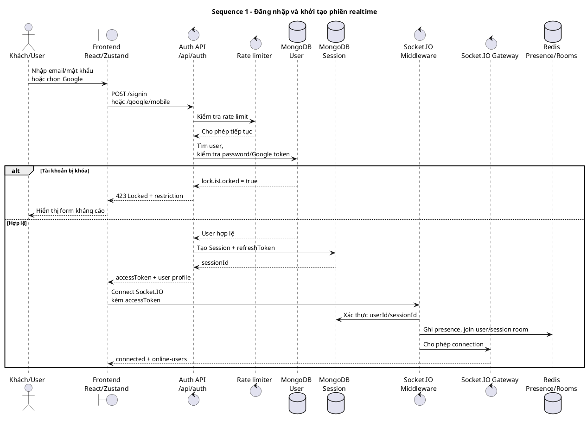
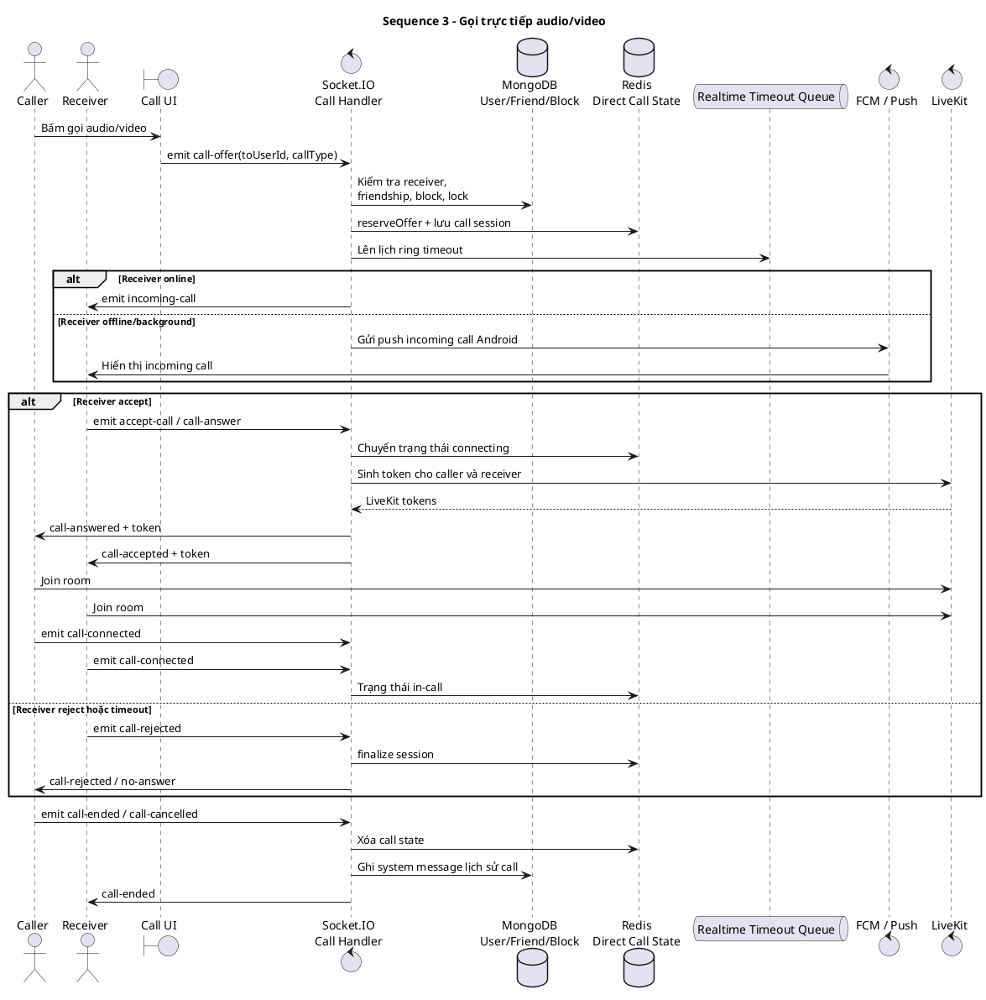
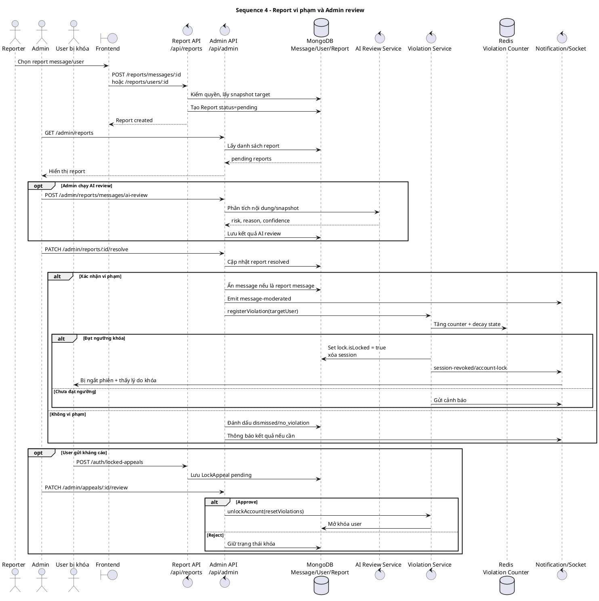

# Sequence Diagrams chính của NexCon

Dựa trên phần `4.5. Sequence Diagram` trong `docs/generate_nexcon_full_report.py` và các route/controller/socket tương ứng, dự án có **5 sơ đồ sequence chính**:

1. Đăng nhập và khởi tạo phiên realtime
2. Gửi tin nhắn realtime và hậu kiểm AI
3. Gọi trực tiếp audio/video
4. Report vi phạm và Admin review
5. Disappearing messages

## 1. Đăng nhập và khởi tạo phiên realtime



## 2. Gửi tin nhắn realtime và hậu kiểm AI

```plantuml
@startuml
title Sequence 2 - Gửi tin nhắn realtime và hậu kiểm AI

actor "Sender" as Sender
actor "Receiver" as Receiver
boundary "Frontend Chat" as FE
control "Message API\n/api/messages/send" as MsgAPI
control "Message middleware" as MW
database "MongoDB\nConversation/Message" as Mongo
cloud "Cloudinary" as Cloud
control "Socket.IO Gateway" as Socket
control "Moderation worker\nsetImmediate" as ModWorker
control "Gemini / AssemblyAI" as AI
control "Notification Service" as Notify
database "Redis / Push / FCM" as Push

Sender -> FE: Soạn text/link/image/audio/file
FE -> MsgAPI: POST /api/messages/send
MsgAPI -> MW: Kiểm tra membership,\nblock, lock, file
MW --> MsgAPI: Hợp lệ

opt Có media
    MsgAPI -> Cloud: Upload authenticated asset
    Cloud --> MsgAPI: publicId/file metadata
end

MsgAPI -> Mongo: Lưu Message\nmoderationStatus = pending_review
MsgAPI -> Mongo: Cập nhật Conversation,\nunread count, lastMessage
MsgAPI -> Socket: Emit new-message\nvào conversation room
Socket -> Receiver: new-message
MsgAPI --> FE: 201 Created + message payload

MsgAPI -> ModWorker: Chạy hậu kiểm nền
ModWorker -> AI: Local signal + Gemini\nAssemblyAI nếu audio
AI --> ModWorker: approved / rejected / skipped

alt Nội dung an toàn hoặc skipped
    ModWorker -> Mongo: Cập nhật moderationStatus
    ModWorker -> Notify: Tạo notification nếu cần
    Notify -> Push: Socket/Web Push/FCM
else Nội dung vi phạm
    ModWorker -> Mongo: Set reportStatus,\nẩn content/searchContent
    opt Media vi phạm
        ModWorker -> Cloud: Cleanup asset nếu không còn tham chiếu
    end
    ModWorker -> Socket: Emit message-moderated
    Socket -> Receiver: Cập nhật UI tin vi phạm
end

Receiver -> Socket: message-delivered
Socket -> Mongo: Lưu deliveredTo
Socket -> FE: message-delivered-ack

@enduml
```

## 3. Gọi trực tiếp audio/video



## 4. Report vi phạm và Admin review



## 5. Disappearing messages

```plantuml
@startuml
title Sequence 5 - Disappearing messages

actor "User/Admin nhóm" as User
actor "Sender" as Sender
actor "Member" as Member
boundary "Frontend Chat" as FE
control "DM API\n/api/dm" as DMAPI
control "Message API" as MsgAPI
database "MongoDB\nConversation/Message" as Mongo
database "Redis\nCountdown/Queue" as Redis
control "Socket.IO Gateway" as Socket
queue "Disappearing Worker" as Worker
cloud "Cloudinary" as Cloud

User -> FE: Bật/tắt disappearing mode
FE -> DMAPI: PUT /conversations/:id/disappearing
DMAPI -> Mongo: Kiểm quyền participant/admin nhóm
DMAPI -> Mongo: Lưu enabled, durationSeconds,\ndisableAt, enabledBy
DMAPI -> Mongo: Tạo system message
DMAPI -> Socket: Emit dm:disappearing-setting-updated
Socket -> Member: Cập nhật setting realtime
DMAPI --> FE: Trả setting mới

Sender -> FE: Gửi message khi mode active
FE -> MsgAPI: POST /api/messages/send
MsgAPI -> Mongo: Đọc setting conversation
alt Mode active
    MsgAPI -> Mongo: Lưu Message với expiresAt = now + 24h
    MsgAPI -> Redis: Cache countdown TTL
else Mode inactive
    MsgAPI -> Mongo: Lưu Message thường
end
MsgAPI -> Socket: Emit new-message
Socket -> Member: Hiển thị message

loop Mỗi phút
    Worker -> Redis: Nhận job dm-disappearing-expiry
    Worker -> Mongo: Tìm conversation hết disableAt\nvà message hết expiresAt
    Worker -> Mongo: Soft-delete message,\nxóa searchContent/reaction/pin
    opt Message có media
        Worker -> Mongo: Kiểm tra tham chiếu asset còn active
        alt Không còn tham chiếu active
            Worker -> Cloud: Xóa authenticated asset
        else Còn tham chiếu active
            Worker -> Cloud: Giữ asset
        end
    end
    Worker -> Socket: Emit dm:message-expired
    Socket -> Member: UI chuyển sang placeholder
end

opt Android screenshot trong conversation active
    Member -> FE: nexcon:native-screenshot
    FE -> DMAPI: POST /conversations/:id/screenshot
    DMAPI -> Socket: Emit dm:screenshot-detected
    Socket -> User: Thông báo screenshot
end

@enduml
```
