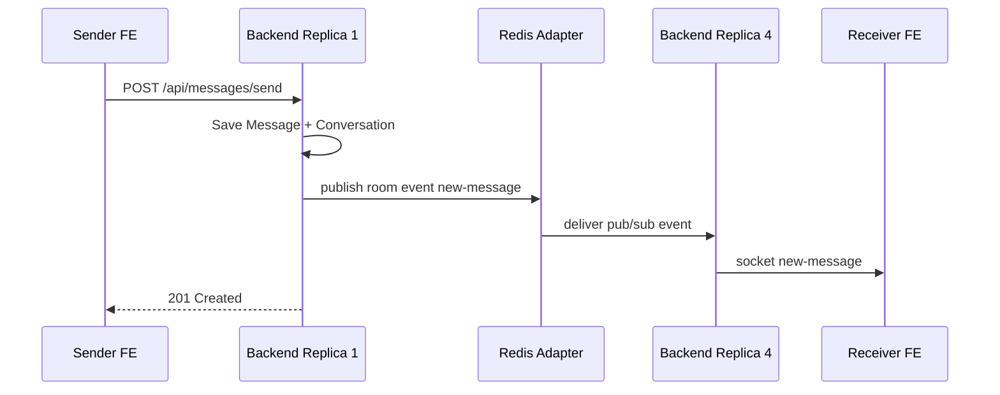
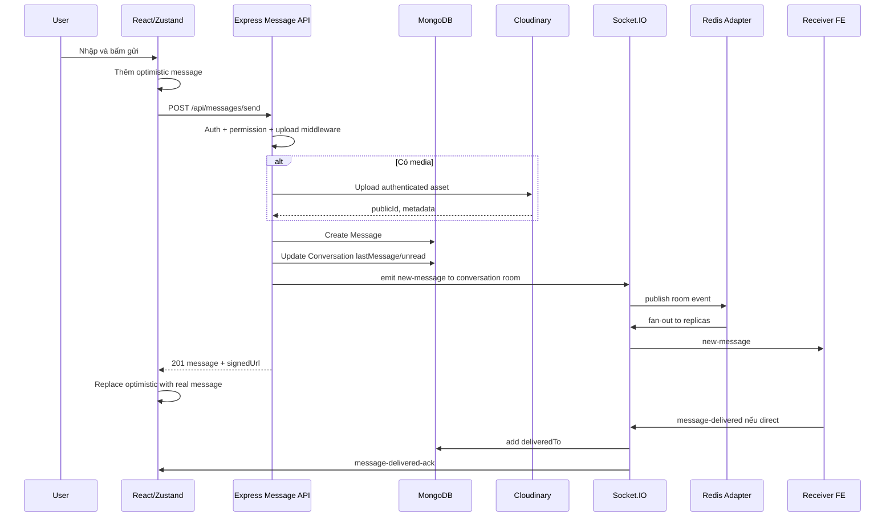

# Socket Messaging Realtime trong NexCon

Cập nhật: 2026-06-15

Tài liệu này mô tả cách phần socket và nhắn tin của NexCon hoạt động từ frontend đến backend, gồm luồng gửi tin, nhận tin realtime, typing, delivered, read receipt, media, moderation và cách hệ thống xử lý khi backend chạy nhiều replica.

## 1. Tóm tắt nhanh

NexCon không gửi tin nhắn chính bằng Socket.IO. Tin nhắn được gửi qua REST API `POST /api/messages/send`, sau đó backend lưu MongoDB và emit Socket.IO event để các client cập nhật realtime.

Luồng chính:

1. Frontend mở socket sau khi user đăng nhập bằng `useSocketStore.connectSocket()`.
2. Socket handshake gửi `accessToken` trong `auth.token`.
3. Backend xác thực JWT và session bằng `socketAuthMiddleware`.
4. Socket join các room:
   - `user:<userId>` cho event cá nhân và đa thiết bị.
   - `session:<sessionId>` cho event theo phiên đăng nhập.
   - `<conversationId>` cho event của hội thoại.
5. Khi gửi tin, FE gọi REST `POST /api/messages/send`.
6. BE kiểm quyền, upload media nếu có, lưu `Message`, cập nhật `Conversation.lastMessage` và `unreadCounts`.
7. BE emit `new-message` vào room `<conversationId>`.
8. FE nhận `new-message`, thêm message vào Zustand store, cập nhật sidebar, phát âm thanh, gửi delivered ack nếu là direct chat.
9. Redis Adapter giúp event phát từ replica này đến socket đang nằm ở replica khác.

## 2. Source map

### Frontend

| File | Vai trò |
|---|---|
| `frontend/src/App.tsx` | Khi user đã đăng nhập và không phải admin thì gọi `connectSocket()`, logout/admin thì `disconnectSocket()`. |
| `frontend/src/stores/useSocketStore.ts` | Socket.IO client chính: connect, reconnect, listener event, emit typing, join conversation, delivered. |
| `frontend/src/stores/useChatStore.ts` | State chat: conversations, messages, optimistic message, fetch messages, mark seen, local update khi có socket event. |
| `frontend/src/services/chatService.ts` | REST client cho `/api/messages`, `/api/conversations`. |
| `frontend/src/components/chat/MessageInput.tsx` | UI soạn tin, attachment, mention, typing indicator, gọi `sendMessage`. |
| `frontend/src/components/chat/ChatWindowLayout.tsx` | Khi mở hội thoại thì gọi `joinConversation()`, fetch messages, mark seen. |
| `frontend/src/components/chat/ChatWindowBody.tsx` | Render message list, typing indicator, infinite scroll, jump to message, auto scroll. |
| `frontend/src/lib/axios.ts` | Axios instance, gắn access token, refresh token khi API trả 401. |
| `frontend/src/socket.js` | Singleton socket cũ dùng `process.env.BACKEND_URL`; hiện không thấy được import trong source FE. Luồng chính đang dùng `useSocketStore.ts`. |

### Backend

| File | Vai trò |
|---|---|
| `backend/src/server.js` | Khởi động Express, route API, worker, rồi listen sau khi Socket.IO Redis Adapter sẵn sàng hoặc fail gracefully. |
| `backend/src/socket/index.js` | Tạo `io`, auth middleware, room join, presence, typing, delivered, call handler, export gateway helper. |
| `backend/src/middlewares/socketMiddleware.js` | Xác thực socket bằng JWT, session MongoDB, kiểm tra tài khoản bị khóa. |
| `backend/src/socket/socketGateway.js` | Lưu reference tới `io`, `emitToUser`, `joinUserSocketsToRoom`, để controller/service dùng mà tránh import vòng phức tạp. |
| `backend/src/config/socketIoRedisAdapter.js` | Cấu hình `@socket.io/redis-adapter` bằng 2 Redis client pub/sub. |
| `backend/src/services/socketPresenceService.js` | Lưu presence socket/user vào Redis, TTL, prune socket chết. |
| `backend/src/services/userStatusService.js` | Build payload presence theo quyền xem của từng viewer. |
| `backend/src/routes/messageRoute.js` | Route `/api/messages/send`, recall, pin, reaction, media URL, forward. |
| `backend/src/controllers/messageController.js` | Logic gửi tin, upload, moderation, notification, emit realtime. |
| `backend/src/controllers/conversationController.js` | Lấy hội thoại, lấy messages, mark seen/unread, group membership event. |
| `backend/src/utils/messageHelper.js` | `updateConversationLastMessage`, `emitNewMessage`, signed URL media. |
| `backend/src/models/messageModel.js` | Schema message. |
| `backend/src/models/conversationModel.js` | Schema conversation, participants, unread/read state. |

## 3. Socket connection lifecycle

### 3.1. FE khởi tạo socket

Trong `frontend/src/App.tsx`, khi có `accessToken`, có `user`, và user không phải admin:

```ts
connectSocket();
useFriendStore.getState().fetchFriends();
useNotificationStore.getState().fetchNotifications();
useChatStore.getState().fetchConversations();
```

Trong `useSocketStore.connectSocket()`:

```ts
const socket: Socket = io(baseURL, {
  auth: { token: accessToken },
  transports: ["websocket"],
});
```

Các điểm quan trọng:

- `baseURL = import.meta.env.VITE_SOCKET_URL`.
- Chỉ dùng `websocket`, không dùng polling fallback.
- Điều này phù hợp với môi trường load balancer nhiều replica, vì long-polling cần sticky session nếu không ép WebSocket.

### 3.2. BE xác thực socket

Backend dùng:

- `jwt.verify(token, process.env.ACCESS_TOKEN_SECRET)`.
- `Session.findOne({ _id: sessionId, userId })`.
- `User.findById(decoded.userId).select("-password")`.
- Từ chối nếu session hết hạn, session bị xóa, user không tồn tại, hoặc `user.lock.isLocked`.

Sau khi hợp lệ:

```js
socket.user = user;
socket.sessionId = session._id.toString();
```

### 3.3. Room sau khi connect

Khi `io.on("connection")` chạy, backend join:

```js
socket.join(`user:${userId}`);
socket.join(`session:${sessionId}`);
```

Sau đó backend join hội thoại trong background:

```js
const conversationIds = await getUserConversationsForSocketIO(user._id);
conversationIds.forEach((id) => socket.join(id));
```

Frontend cũng chủ động emit khi mở một hội thoại:

```ts
socket.emit("join-conversation", { conversationId });
```

Backend kiểm tra conversation tồn tại và socket user là participant trước khi join.

### 3.4. Session revalidation khi socket đang sống

Backend không chỉ xác thực lúc handshake. Nó còn gắn `socket.use(...)` để kiểm tra session định kỳ khi client emit packet:

- Env: `SOCKET_SESSION_REVALIDATE_MS`, mặc định `60000`.
- Nếu session không còn hợp lệ, backend emit `session-revoked` rồi disconnect.

Lưu ý hiện trạng: backend có emit `session-revoked`, nhưng frontend hiện chưa có listener rõ ràng cho event này trong `useSocketStore.ts`. FE vẫn nhận `disconnect` và cơ chế API refresh/logout xử lý ở lớp auth, nhưng nếu muốn UI phản hồi chính xác hơn có thể bổ sung listener `session-revoked`.

## 4. Room design

| Room | Ví dụ | Dùng cho |
|---|---|---|
| Socket id mặc định | `socket.id` | Socket.IO tự có cho từng connection. |
| User room | `user:665...` | Emit tới mọi tab/thiết bị của một user. |
| Session room | `session:665...` | Disconnect hoặc notify một phiên đăng nhập cụ thể. |
| Conversation room | `665f...abc` | Emit message, typing, read receipt, group update cho hội thoại. |

Tên hàm `getReceiverSocketId(userId)` hơi gây hiểu nhầm. Hàm này không trả socket id thật, mà trả room cá nhân:

```js
function getReceiverSocketId(userId) {
  return userId ? `user:${userId}` : null;
}
```

Điều này tốt cho đa thiết bị: một user có nhiều tab hoặc nhiều thiết bị vẫn nhận event qua cùng room `user:<id>`.

## 5. Presence online/offline

Presence không lưu trong RAM của từng Node process. Backend dùng Redis trong `socketPresenceService.js`.

Key chính:

| Key | Nội dung |
|---|---|
| `nexcon:presence:users` | Set userId đang online. |
| `nexcon:presence:socket:<socketId>` | Hash gồm `userId`, `sessionId`, `instanceId`, `connectedAt`. |
| `nexcon:presence:user:<userId>:sockets` | Set socketId của user. |

TTL:

- `SOCKET_PRESENCE_TTL_SECONDS`, mặc định `120`.
- Socket refresh presence mỗi `45_000ms`.
- User socket set hết hạn sau TTL + 30 giây.

Khi socket connect:

1. `registerSocketPresence({ socketId, userId, sessionId })`.
2. Emit `online-users` cho sockets local.
3. `io.serverSideEmit("presence-changed")` để các replica khác refresh payload cho sockets của chúng.

Khi socket disconnect:

1. Xóa socket key.
2. Xóa socketId khỏi set của user.
3. Prune socket chết.
4. Nếu user không còn socket sống, xóa user khỏi online set.

Payload `online-users` không chỉ là list id thô. Backend gọi `buildPresencePayloadForViewer(viewerId)`, chỉ trả presence user mà viewer được phép thấy, dựa trên bạn bè và block. Vì vậy hai user khác nhau có thể nhận payload presence khác nhau.

## 6. Luồng gửi tin nhắn end-to-end

### 6.1. FE soạn tin

`MessageInput.tsx` xử lý:

- Text, link, sticker.
- Image, file, audio.
- Reply message.
- Mention.
- Multi-image batch tối đa 10 ảnh.
- Draft trong Zustand/session storage.
- Typing indicator.

Khi gửi:

1. Xác định type:
   - Có attachment thì theo attachment.
   - Text là URL thì type `link`.
   - Còn lại là `text`.
2. Với direct chat, payload có `recipientId`.
3. Với group chat, payload có `conversationId`.
4. Text dài được tách theo `MAX_TEXT_MESSAGE_LENGTH = 1000`.
5. Ảnh nhiều file dùng metadata:
   - `clientBatchId`
   - `clientBatchIndex`
   - `clientBatchSize`

### 6.2. FE optimistic UI

`useChatStore.sendMessage()` tạo message tạm:

```ts
const optimistic = {
  _id: tempId,
  conversationId: convoId,
  senderId: user._id,
  type: payload.type,
  content: payload.content ?? null,
  fileUrl: tempBlobUrl,
  status: "sending",
  clientTempId: tempId,
};
```

Message tạm được thêm ngay vào `messages[convoId].items`, nên UI phản hồi trước khi API hoàn tất.

Sau khi API trả message thật:

- Nếu có `signedUrl`, cache vào `useMediaCacheStore`.
- Update conversation từ message thật.
- Thay message tạm bằng message thật.
- Set `status: "sent"`.
- Revoke blob URL local.

Nếu lỗi:

- Message tạm chuyển `status: "error"`.
- Input khôi phục text/file nếu phù hợp.
- Lỗi moderation được hiển thị bằng toast riêng.

### 6.3. FE gọi REST API

`chatService.sendMessage()` gửi `multipart/form-data`:

```ts
POST /api/messages/send
type
recipientId hoặc conversationId
content
file
fileName
replyTo
mentions
metadata
```

Axios tự gắn:

```ts
Authorization: Bearer <accessToken>
withCredentials: true
```

Nếu API trả 401, `frontend/src/lib/axios.ts` refresh access token rồi retry request.

### 6.4. BE middleware

Route:

```js
messageRouter.post(
  "/send",
  upload.single("file"),
  handleUploadError,
  checkMessagePermission,
  sendMessage
);
```

Trước đó `server.js` đã gắn:

- `authMiddleware`
- `auditLogMiddleware`
- `requireUser`
- `apiLimiter`

`checkMessagePermission` xử lý:

- Direct chat:
  - Kiểm tra recipient tồn tại.
  - Không cho gửi tới tài khoản bị khóa.
  - Kiểm tra friendship.
  - Tìm direct conversation có sẵn bằng `directKey`.
- Group chat:
  - Conversation tồn tại.
  - Nhóm chưa bị giải tán.
  - User là participant.
  - Direct conversation cũng kiểm tra người còn lại có bị khóa không.

### 6.5. BE tạo Message

Trong `sendMessage()`:

1. Nếu direct conversation chưa có, tạo `Conversation` type `direct`.
2. Build `messageData` gồm:
   - `conversationId`
   - `senderId`
   - `senderInfo`
   - `type`
   - disappearing fields nếu conversation bật tự xóa.
3. Theo type:
   - `text`: trim content, giới hạn 1000 ký tự, set moderation pending.
   - `link`: normalize URL, fetch preview, set moderation pending.
   - `image`: validate MIME/size, upload Cloudinary authenticated, set `filePublicId`, pending image moderation.
   - `file`: upload raw file, set metadata, pending moderation.
   - `audio`: chỉ hỗ trợ `audio/webm`, upload raw, pending transcript/moderation.
   - `sticker`: lưu URL sticker, không moderation trong code hiện tại.
4. Parse mentions bằng `buildMentionsForContent`.
5. Validate `replyTo`.
6. `Message.create(messageData)`.
7. Cache countdown nếu là disappearing message.
8. Populate `replyTo` nếu có.

### 6.6. BE cập nhật Conversation

`saveConversationForNewMessage()`:

- Load conversation mới nhất.
- Tăng `unreadMentionCount` cho participant được mention.
- Gọi `updateConversationLastMessage(conversation, message, senderId)`.
- Save conversation, retry tối đa 3 lần nếu `VersionError`.

`updateConversationLastMessage()` làm nhiều việc:

- Tạo preview cho `Conversation.lastMessage`.
- Copy metadata quan trọng, mentions, deliveredTo, expiresAt.
- Tăng `unreadCounts` cho participant không phải sender.
- Reset unread của sender về 0.
- Set sender `lastReadMessageId` và `lastReadAt`.
- Invalidate read cache của conversation.

### 6.7. BE join room nếu vừa tạo direct conversation

Nếu direct conversation được tạo ngay trong request gửi tin, user có thể chưa join room hội thoại. Backend xử lý ngay:

```js
joinUserSocketsToRoom(participantId, conversation._id.toString());
emitToUser(participantId, "new-conversation", { conversation });
```

`joinUserSocketsToRoom()` dùng:

```js
io.in(`user:${userId}`).socketsJoin(roomName);
```

Với Redis Adapter, thao tác này có thể áp dụng cho sockets của user dù chúng đang nằm ở replica khác.

### 6.8. BE emit `new-message`

`emitNewMessage(io, conversation, message, signedUrl)` emit vào room hội thoại:

```js
io.to(conversation._id.toString()).emit("new-message", {
  message: payloadMessage,
  conversation: {
    _id: conversation._id,
    lastMessage,
    lastMessageAt,
  },
  unreadCounts: conversation.unreadCounts,
});
```

Event đi vào room `<conversationId>`, không emit riêng từng socket.

### 6.9. FE nhận `new-message`

Trong `useSocketStore.ts`:

1. Cache `signedUrl` nếu có.
2. Nếu không ở jump mode, gọi `useChatStore.addMessage(message)`.
3. Build conversation patch và update sidebar.
4. Nếu hội thoại đang focused, gọi `markAsSeen()`.
5. Nếu message không phải của mình và không mute:
   - Phát âm thanh.
   - Flash tab title nếu app không visible.
   - Native local notification nếu chạy Capacitor.
6. Nếu direct chat và message từ người khác, emit `message-delivered`.

`useChatStore.addMessage()` dedupe theo `_id`. Nếu message socket là bản thật tương ứng với optimistic message, store dùng `canUseOptimisticSlot()` để thay message tạm bằng message thật thay vì append trùng.

## 7. Delivered receipt

Delivered trong app nghĩa là tin direct đã đến thiết bị/người nhận, chưa phải là đã đọc.

### 7.1. Khi nào FE emit `message-delivered`

FE emit trong 3 nơi chính:

- Khi socket connect lại: duyệt conversations/messages đã cache, tìm direct message chưa có current user trong `deliveredTo`.
- Khi fetch conversations: nếu lastMessage direct chưa delivered thì emit.
- Khi fetch messages hoặc nhận `new-message` direct từ người khác.

Payload:

```ts
socket.emit("message-delivered", {
  messageId,
  conversationId,
});
```

### 7.2. BE xử lý delivered

Backend:

1. Kiểm tra `messageId`, `conversationId`.
2. Kiểm tra user là participant của conversation.
3. `markDeliveredForMessage()` update message:
   - Không phải sender.
   - Chưa có user trong `deliveredTo`.
   - Message chưa expired.
4. Nếu message là lastMessage, update `Conversation.lastMessage.deliveredTo`.
5. Emit:
   - `message-delivered-sync` tới user vừa delivered, để đồng bộ nhiều tab/thiết bị.
   - `message-delivered-ack` tới sender.

### 7.3. Server tự sync pending deliveries khi connect

Khi socket connect, backend gọi `syncPendingDirectMessageDeliveries(userId)`:

- Tìm direct conversations của user.
- Tìm message người khác gửi mà chưa có user trong `deliveredTo`.
- Update batch tối đa 200 message, tối đa 10 batch.
- Emit delivered update cho sender và delivered user.

Cơ chế này bù cho trường hợp FE chưa kịp emit delivered hoặc client reconnect sau khi offline.

## 8. Read receipt và unread count

Read receipt đi qua REST, sau đó broadcast bằng socket.

FE gọi `markAsSeen()` khi:

- Mở/focus hội thoại trong `ChatWindowLayout`.
- Nhận `new-message` cho hội thoại đang focused.
- Textarea focus trong `MessageInput`.

API:

```http
PATCH /api/conversations/:conversationId/mark-seen
```

Backend:

- Tìm latest message.
- Nếu đã seen thì trả sớm.
- Set:
  - `unreadCounts.<userId> = 0`
  - `participants.$.unreadMentionCount = 0`
  - `participants.$.lastReadMessageId = latestMessageId`
  - `participants.$.lastReadAt = now`
- Emit `read-message`.

Nếu direct chat đang bị block, backend chỉ emit `read-message` vào `user:<currentUserId>` để sync thiết bị của chính mình, không báo cho người kia.

FE nhận `read-message` và cập nhật:

- `unreadCounts` của current user.
- Participant `lastReadMessageId`.
- Participant `lastReadAt`.
- `unreadMentionCount`.

## 9. Typing indicator

Typing đi hoàn toàn bằng socket, không lưu DB.

FE:

- Khi textarea có text: emit `typing`.
- Sau 2 giây không nhập: emit `stop-typing`.
- Khi unmount input hoặc gửi tin: emit `stop-typing`.

Backend:

- Nhận `typing` hoặc `stop-typing`.
- Kiểm tra conversation tồn tại.
- Kiểm tra user là participant.
- Với direct chat, kiểm tra không bị block và vẫn là bạn bè.
- Emit sang room conversation nhưng loại trừ socket gửi:

```js
socket.to(conversationId).emit("user-typing", { conversationId, userId });
socket.to(conversationId).emit("user-stopped-typing", { conversationId, userId });
```

FE:

- `useSocketStore` lưu `typingUsers[conversationId]`.
- Có timer tự expire sau `TYPING_INDICATOR_TIMEOUT_MS = 3500`.
- Nếu user offline trong payload `online-users`, xóa typing indicator.
- `ChatWindowBody` render inline hoặc floating typing pill tùy vị trí scroll.

## 10. Recall, pin, reaction, moderation

### 10.1. Recall message

FE gọi:

```http
PUT /api/messages/recall
```

Backend:

- Chỉ sender được recall.
- Không recall system message hoặc expired message.
- Chỉ trong 1 giờ.
- Xóa Cloudinary asset nếu có.
- Set `isRecalled = true`, bỏ pin nếu đang pinned.
- Emit `recall-message` vào room conversation.
- Nếu message đang pinned, emit thêm `pin-message` để unpin.

FE nhận `recall-message` và gọi `recallMessageLocal()`, đồng thời refresh conversations.

### 10.2. Pin message

FE gọi:

```http
PUT /api/messages/pin
```

Backend:

- Không pin system/disappearing/expired/violation message.
- Direct chat bị block thì không pin.
- Tối đa 3 pinned message trong một conversation.
- Emit `pin-message`.
- Tạo system message `message_pinned` hoặc `message_unpinned`.
- Emit `new-message` cho system message đó.

FE nhận `pin-message` và cập nhật pinned local.

### 10.3. Reaction

FE gọi:

```http
PUT /api/messages/:messageId/react
```

Backend:

- Kiểm tra membership qua `checkConversationMembership`.
- Không react message vi phạm hoặc expired.
- Toggle emoji nếu user bấm lại emoji cũ.
- Emit `message-reaction` tới từng `user:<participantId>`.

FE nhận `message-reaction` và update reactions trong store.

### 10.4. Moderation sau khi đã emit message

NexCon emit message trước với metadata pending review, rồi chạy moderation nền bằng `setImmediate`.

Với text/link/image/file/audio:

- Message được lưu với `metadata.moderationStatus = pending_review`.
- Image có thêm `metadata.imageModerationStatus = pending_review`.
- Audio có `metadata.transcriptStatus = pending`.

Nếu moderation approved hoặc skipped:

- Update metadata.
- Với audio, nếu có transcript thì cập nhật `content` và emit `message-moderation-updated`.
- Sau đó schedule notification.

Nếu moderation rejected:

- Set `reportStatus = true`.
- Cleanup media vi phạm nếu có.
- Nếu message là lastMessage, update preview thành nội dung vi phạm.
- Emit `message-moderated`.

FE nhận:

- `message-moderation-updated`: patch content/metadata.
- `message-moderated`: ẩn nội dung, xóa khỏi media cache/list, bỏ pinned message liên quan.

## 11. Media và signed URL

Media upload qua REST, không qua socket.

Backend upload lên Cloudinary dạng authenticated:

- Image: `uploadChatImageFromBuffer`.
- File: `uploadRawFileFromBuffer`.
- Audio: `uploadAudioFromBuffer`.

Message lưu `filePublicId`, `fileName`, `fileSize`, `mimeType`.

Khi emit/return response, backend có thể tạo `signedUrl` bằng:

```js
cloudinary.utils.private_download_url(filePublicId, "", {
  resource_type,
  type: "authenticated",
  expires_at,
  secure: true,
});
```

FE cache URL trong `useMediaCacheStore`. Khi cần tải lại URL cho media cũ, FE gọi:

```http
GET /api/messages/:messageId/media-url
```

Backend kiểm tra:

- Message tồn tại.
- Có `filePublicId`.
- Không violation.
- Không expired.
- User là participant.
- Message chưa nằm trước `clearedAt` của user.
- Nếu `metadata.visibleToUserIds` có set thì user phải nằm trong list đó.

## 12. Mentions và notification

Mention được parse ở backend bằng `buildMentionsForContent`.

Khi gửi message có mention:

- `saveConversationForNewMessage()` tăng `unreadMentionCount` cho user được mention.
- Sau moderation approved/skipped, backend gọi `sendPostMessageNotifications`.
- Với từng mentioned user:
  - Thử emit realtime `user_mentioned` tới `user:<mentionedUserId>`.
  - Nếu không delivered, tạo notification MongoDB bằng `createNotification`.
  - Gửi Web Push nếu có subscription.

FE nhận `user_mentioned`:

- Tăng `unreadMentionCount` local nếu hội thoại không focused.
- Toast có action mở đúng `/chat?conversationId=...&messageId=...`.
- Browser notification nếu được cấp quyền.
- Sound nếu không focused.

Regular message push đi qua `sendOfflineMessagePushes` và FCM. Lưu ý: trong code hiện tại, hàm này gửi FCM cho recipient hợp lệ không mute và không phải sender; tên hàm là "Offline" nhưng không tự query Redis online/offline trước khi gửi.

## 13. Conversation và group events liên quan tới nhắn tin

Các thay đổi conversation/group cũng emit socket để UI đồng bộ.

| Event | Scope | Khi nào emit |
|---|---|---|
| `new-conversation` | `user:<id>` | Tạo conversation mới hoặc thêm member mới cần thấy conversation. |
| `conversation-updated` | `user:<id>` hoặc tùy controller | Pin/unread/mute/update conversation cá nhân. |
| `members-added` | room conversation | Thêm member vào nhóm. |
| `member-removed` | room conversation | Admin xóa member. |
| `kicked-from-group` | `user:<removedUserId>` | Member bị xóa khỏi nhóm. |
| `member-left` | room conversation | Member rời nhóm. |
| `left-group` | `user:<leftUserId>` | Sync thiết bị của người vừa rời nhóm. |
| `admin-transferred` | room conversation | Chuyển trưởng nhóm. |
| `group-disbanded` | room conversation | Nhóm bị giải tán. |
| `conversation-cleared` | `user:<id>` | Người dùng clear hội thoại local. |
| `conversation-mute-updated` | room/user tùy flow | Cập nhật mute messages/meetings. |
| `dm:disappearing-setting-updated` | room conversation | Bật/tắt tin nhắn tự xóa. |
| `dm:message-expired` | room conversation | Worker hoặc local expiry làm message hết hạn. |

Một số action group tạo system message, sau đó cũng đi qua `emitNewMessage`, ví dụ:

- `member_added`
- `member_kicked`
- `member_left`
- `admin_transferred`
- `message_pinned`
- `message_unpinned`
- `group_disbanded`

## 14. Multi-replica Socket.IO

### 14.1. Vấn đề khi chạy nhiều replica

Giả sử production có 6 backend replicas:

- User A gửi REST request tới Replica 1.
- User B đang giữ WebSocket ở Replica 4.
- Nếu Replica 1 chỉ emit bằng memory local, B sẽ không nhận event.
- Nếu presence chỉ lưu trong RAM, Replica 1 cũng không biết B online.

NexCon giải bằng 2 lớp Redis:

1. Redis Adapter cho Socket.IO event/room.
2. Redis presence store cho trạng thái online/socket mapping.

### 14.2. Redis Adapter

`configureSocketIoRedisAdapter(io)` tạo 2 Redis clients:

- `pubClient`
- `subClient`

Sau đó:

```js
io.adapter(createAdapter(pubClient, subClient));
```

Khi một replica gọi:

```js
io.to(conversationId).emit("new-message", payload);
```

Socket.IO Redis Adapter publish event qua Redis. Các replica khác subscribe được event và emit tới sockets local đang nằm trong room đó.

Ví dụ:



### 14.3. Room membership trong multi-replica

Mỗi socket vẫn chỉ nằm thật trên một replica. Nhưng room operation có thể lan qua adapter.

Ví dụ khi vừa tạo direct conversation:

```js
io.in(`user:${participantId}`).socketsJoin(conversationId);
```

Nếu socket của participant đang ở replica khác, Redis Adapter giúp thao tác join được áp dụng đúng.

### 14.4. Presence trong multi-replica

Presence lưu Redis với `instanceId`, TTL và set socket per user. `instanceId` lấy từ:

- `RAILWAY_REPLICA_ID`
- hoặc `RAILWAY_DEPLOYMENT_ID`
- hoặc `HOSTNAME`
- hoặc `local-<pid>`

Điều này giúp debug socket đang thuộc replica nào.

Khi presence thay đổi, replica hiện tại gọi:

```js
io.serverSideEmit("presence-changed");
```

Các replica nhận `presence-changed` sẽ tự build payload `online-users` cho sockets đang local trên replica của mình. Nhờ vậy mỗi socket nhận đúng presence visibility theo viewer.

### 14.5. Vì sao ép WebSocket transport

FE cấu hình:

```ts
transports: ["websocket"]
```

Với WebSocket, sau handshake, connection là một TCP/WebSocket lâu dài gắn với một replica. Redis Adapter xử lý broadcast cross-replica.

Nếu bật HTTP long-polling fallback trong production:

- Các request polling của cùng một socket có thể bị load balancer đưa sang replica khác.
- Cần sticky session ở load balancer.
- Nếu không sticky, socket có thể reconnect/error hoặc mất event.

Vì vậy cấu hình hiện tại ép WebSocket là hợp lý.

### 14.6. Khi Redis Adapter fail

`configureSocketIoRedisAdapter(io)` catch lỗi và trả `false`. Server vẫn có thể listen, nhưng:

- Single replica vẫn chạy được realtime local.
- Multi-replica sẽ mất khả năng emit xuyên replica.
- Presence Redis cũng có thể không hoạt động nếu Redis IO unavailable.

Trong production nhiều replica, Redis không phải optional. Cần alert khi log có:

- `[Socket.IO] Redis adapter disabled`
- `[RedisIO] Lỗi kết nối`
- `[Presence] Redis is not ready`

## 15. Recovery khi mất event

Realtime không phải nguồn dữ liệu duy nhất. MongoDB mới là source of truth.

FE có nhiều cơ chế bù:

- Khi socket reconnect:
  - `fetchConversations(true)`.
  - Nếu có active conversation, reset cursor và `fetchMessages(activeConversationId)`.
- Khi mở conversation:
  - `joinConversation(activeConversationId)`.
  - Nếu chưa có messages và online, fetch messages.
- Khi nhận `new-message` nhưng chưa có message cache của conversation:
  - `addMessage()` gọi `fetchMessages(message.conversationId)`.
- Khi deep link tới message:
  - `jumpToMessage(conversationId, messageId)` gọi API với `aroundId`.

Backend cũng bù delivered bằng `syncPendingDirectMessageDeliveries()` khi socket connect.

## 16. Event map nhắn tin

### Client emit lên server

| Event | Payload | Backend xử lý |
|---|---|---|
| `join-conversation` | `{ conversationId }` | Check membership, join room conversation. |
| `typing` | `{ conversationId }` | Check permission, emit `user-typing`. |
| `stop-typing` | `{ conversationId }` | Check permission, emit `user-stopped-typing`. |
| `message-delivered` | `{ messageId, conversationId }` | Check membership, update `deliveredTo`, emit ack/sync. |

### Server emit xuống client

| Event | Scope | FE xử lý |
|---|---|---|
| `online-users` | socket local của từng viewer | Update `onlineUsers`, `userPresences`, clear typing user offline. |
| `new-message` | room conversation hoặc user room với private system message | Add message, update conversation, sound/notification, mark seen/delivered. |
| `read-message` | room conversation hoặc self user room nếu bị block | Update unread/read state. |
| `message-delivered-ack` | sender user room | Sender thấy tin đã delivered. |
| `message-delivered-sync` | delivered user room | Sync delivered state trên nhiều thiết bị người nhận. |
| `user-typing` | room conversation | Show typing indicator. |
| `user-stopped-typing` | room conversation | Hide typing indicator. |
| `recall-message` | room conversation | Mark recalled local, refresh conversations. |
| `pin-message` | room conversation | Update pinned/unpinned local. |
| `message-reaction` | participant user rooms | Update reactions. |
| `message-moderated` | room conversation | Hide violation content/media. |
| `message-moderation-updated` | room conversation | Patch moderation metadata/audio transcript. |
| `user_mentioned` | mentioned user room | Toast/browser notification, update mention count. |
| `new-conversation` | participant user room | Add/update conversation, join room, refetch. |
| `conversation-updated` | user room | Patch conversation, refetch. |
| `members-added` | room conversation | Update participants and conversation list. |
| `member-removed` | room conversation | Update participants and conversation list. |
| `kicked-from-group` | removed user room | Clear active conversation if needed. |
| `left-group` | leaving user room | Clear active conversation if needed. |

## 17. Data model liên quan realtime

### Message

Các field quan trọng:

- `conversationId`
- `senderId`
- `senderInfo`
- `type`: `text`, `image`, `audio`, `file`, `link`, `system`, `sticker`
- `content`
- `systemType`
- `metadata`
- `mentions`
- `filePublicId`, `fileName`, `fileSize`, `mimeType`
- `replyTo`
- `reactions`
- `deliveredTo`
- `isPinned`, `pinnedAt`
- `isRecalled`
- `reportStatus`
- `expiresAt`, `isExpired`, `expiredAt`

`content` và `searchContent` dùng getter/setter mã hóa trong `messageCrypto.js`. Khi search, backend phải đọc message, decrypt và so khớp nội dung đã normalize.

### Conversation

Các field quan trọng:

- `type`: `direct` hoặc `group`
- `directKey`: unique key cho direct conversation.
- `participants[]`:
  - `userId`
  - `userInfo`
  - `joinedAt`
  - `clearedAt`
  - `pinnedAt`
  - `mute`
  - `unreadMentionCount`
  - `lastReadMessageId`
  - `lastReadAt`
- `lastMessage`
- `unreadCounts`
- group settings/admins/approval queue
- disappearing settings
- disband/cleanup fields

`Conversation.lastMessage` là denormalized preview để sidebar tải nhanh. Khi gửi tin, recall, pin, system message, backend phải cập nhật field này.

## 18. Những điểm dễ nhầm

### Tin nhắn không gửi qua socket

Socket không nhận event kiểu `send-message`. FE gửi message qua REST để tận dụng:

- Auth middleware.
- Upload multipart.
- Rate limit.
- Validation/membership.
- MongoDB transaction-like flow.
- Response có message thật để reconcile optimistic UI.

Socket chỉ dùng để broadcast kết quả và tín hiệu realtime phụ.

### `getReceiverSocketId` không phải socket id

Nó trả `user:<userId>`, tức user room. Tên legacy nhưng cách làm đúng cho multi-device/multi-tab.

### `new-message` có thể đến cả sender

Vì sender cũng join room conversation, sender cũng nhận event `new-message`. FE phải dedupe/reconcile với optimistic message, và code hiện tại đã xử lý bằng `_id` và `clientTempId`.

### Presence không đồng nghĩa friendship list

Payload `online-users` được lọc theo visibility. Không phải user online nào trong Redis cũng xuất hiện với mọi viewer.

### Redis Adapter không lưu message

Redis Adapter chỉ pub/sub event realtime. Message source of truth vẫn là MongoDB. Nếu client missed event, FE fetch lại REST.

### Background moderation emit sau

Message có thể đã hiện trên UI rồi sau đó bị `message-moderated`. Đây là thiết kế hậu kiểm hiện tại, không phải bug.

### `session-revoked` chưa có listener FE rõ ràng

Backend emit event này khi session bị revoke hoặc validation fail. FE hiện xử lý disconnect/reconnect/auth refresh chung, nhưng có thể bổ sung listener để UX rõ hơn.

## 19. Checklist vận hành production nhiều replica

Các biến cần nhất quán trên mọi backend replica:

- `MONGODB_CONNECTION_STRING`
- `REDIS_URL`
- `ACCESS_TOKEN_SECRET`
- `MESSAGE_ENCRYPTION_KEY` nếu đang bật mã hóa message
- Cloudinary env
- Firebase/Web Push env nếu dùng notification
- `FRONTEND_URL`
- `CLIENT_URL`

Socket/env liên quan:

- `VITE_SOCKET_URL`: FE build-time URL tới backend socket.
- `FRONTEND_URL`: Socket.IO CORS origin và link notification.
- `CLIENT_URL`: Express API CORS origin.
- `REDIS_URL`: Redis cho Socket.IO adapter, presence, BullMQ.
- `SOCKET_PRESENCE_TTL_SECONDS`: mặc định 120.
- `PRESENCE_FLUSH_DELAY_MS`: mặc định 2000.
- `SOCKET_SESSION_REVALIDATE_MS`: mặc định 60000.

Khuyến nghị:

- Production giữ `transports: ["websocket"]`.
- Nếu bật polling, phải có sticky session.
- Theo dõi log Redis adapter và Redis IO.
- API replicas nên dùng chung MongoDB/Redis/secrets.
- Worker nặng nên tách process riêng hoặc tắt inline worker ở API replica bằng `ENABLE_INLINE_*_WORKER=false` khi cần.
- Health check backend dùng `/api/auth/health`.

## 20. Sequence tổng quát gửi tin



## 21. Khi cần debug

### Không nhận `new-message`

Kiểm tra:

1. FE đã connect socket chưa, `connectionStatus` có `connected` không.
2. FE có join conversation room chưa, `join-conversation` có emit khi mở chat không.
3. Backend có log Redis adapter enabled không.
4. `VITE_SOCKET_URL`, `FRONTEND_URL`, `CLIENT_URL` có đúng domain/protocol không.
5. User có thực sự là participant không.
6. Nếu direct conversation vừa tạo, `joinUserSocketsToRoom` có chạy không.
7. Nếu nhiều replica, tất cả replica có cùng `REDIS_URL` không.

### Delivered không cập nhật

Kiểm tra:

1. Conversation có type `direct` không. Code hiện chủ yếu delivered cho direct.
2. Receiver có emit `message-delivered` không.
3. Message sender có khác receiver không.
4. Message có expired không.
5. `deliveredTo` trong MongoDB đã có userId chưa.
6. Sender có nhận `message-delivered-ack` không.

### Read receipt không cập nhật

Kiểm tra:

1. FE có gọi `PATCH /conversations/:id/mark-seen` không.
2. Conversation có `lastMessage` không.
3. `unreadCounts.<userId>` trong MongoDB có reset về 0 không.
4. Backend có emit `read-message` không.
5. Direct chat có đang bị block không, nếu có thì backend chỉ emit self-room.

### Presence sai

Kiểm tra:

1. Redis key `nexcon:presence:*` có được tạo không.
2. TTL socket có refresh mỗi 45 giây không.
3. User có bị block hoặc không phải friend nên không thấy presence không.
4. `PRESENCE_FLUSH_DELAY_MS` có quá cao không.
5. Replica có nhận `presence-changed` server-side event không.

## 22. Kết luận

Thiết kế realtime của NexCon đi theo mô hình "REST ghi dữ liệu, Socket.IO broadcast thay đổi". Cách này giúp luồng message dễ kiểm quyền, dễ upload media, có source of truth trong MongoDB và vẫn phản hồi realtime qua Socket.IO. Trong môi trường nhiều replica, Redis Adapter giải quyết bài toán event đi xuyên process, Redis presence giải quyết trạng thái online toàn hệ thống, còn frontend luôn có REST recovery để bù event bị lỡ.
